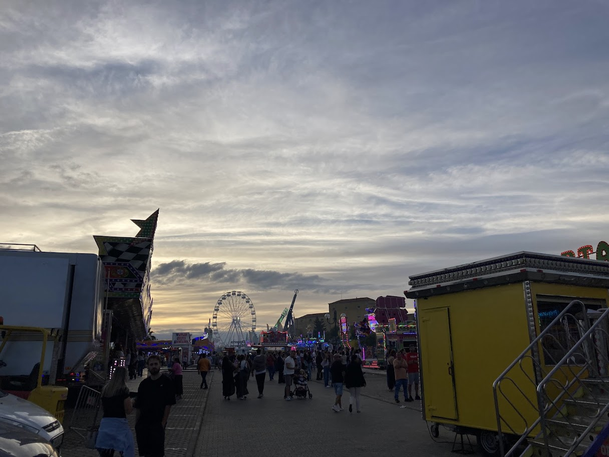
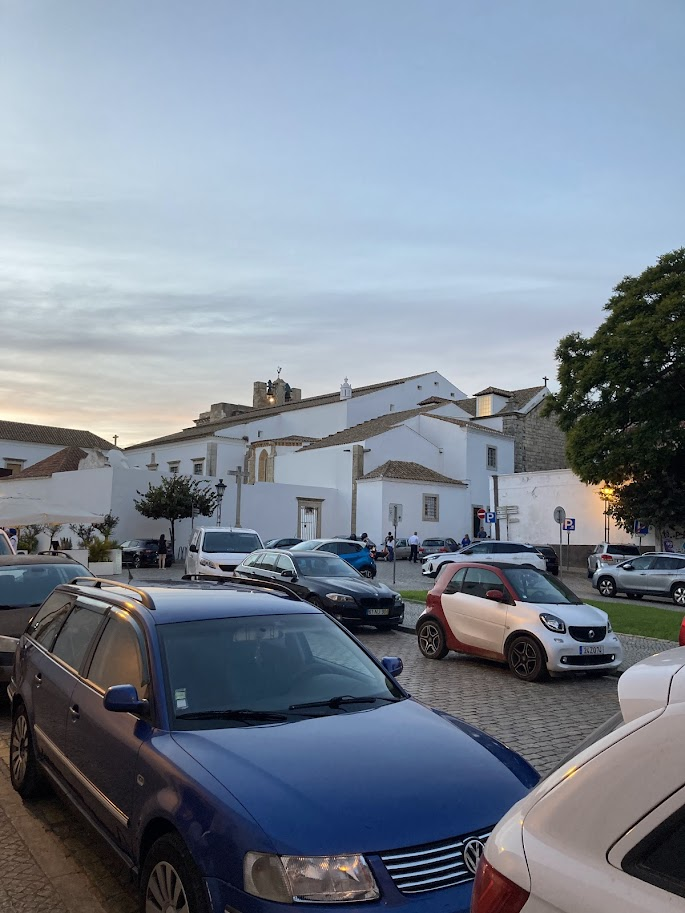

+++
date = '2025-10-25T19:13:44+01:00'
draft = true
title = 'Algarve'
tags = ["týdenní výlet"]
+++

Jelikož jsme se alespoň jednou chtěli podívat až na druhý konec Portugalska, naplánovali jsme na podzimní prázdniny výlet na jih Portugalska - do oblasti Algarve. 

Pronajali jsme si auto u společnosti ... v Portu. Samotné půjčení auta nebylo až tak drahé, ale jelikož se na dálnicích platí docela vysoké poplatky, nakonec vyšlo půjčení docela draho ... Na druhou stranu byla dálniční síť v Portugalsku poměrně pěkná a rozlehlá.

## První den: Faro

Z Porta jsme vyráželi v poledne a naším prvním cílem bylo městečko [Faro](https://mapy.com/s/huvuzonoke) na jižním břehu Portugalska. Cesta nám trvala zhruba 5 a půl hodiny. Jelikož jsme dorazili až při západu slunce, zaparkovali jsme u [ubytování](https://mapy.com/s/rebabufoto) a pak se šli rovnou projít do centra.



Nejprve jsme se báli, že jeden večer nebude stačit na projití celého města, ale opak byl pravdou. První věc, na kterou jsme při procházce narazili, byla obří pouť, která se konala na ploše u pobřeží.

Dál jsme viděli přístav a historické centrum, které bylo sice pěkné, ale maličké a navíc bylo plné zaparkovaných aut, takže to trochu kazilo dojem.


  
  


## První den: Ria Formosa, Lagos

Město Faro ale nebylo naším hlavním cílem. Chtěli jsme navštívit hlavně jeho okolí a přírodní park [Ria Formosa](https://mapy.com/s/napobugoba). Ria Formosa je soubor ostrůvků, písečných dun a jezírek na okraji Fara. Je významným hnízdništěm spousta ptáků a 

