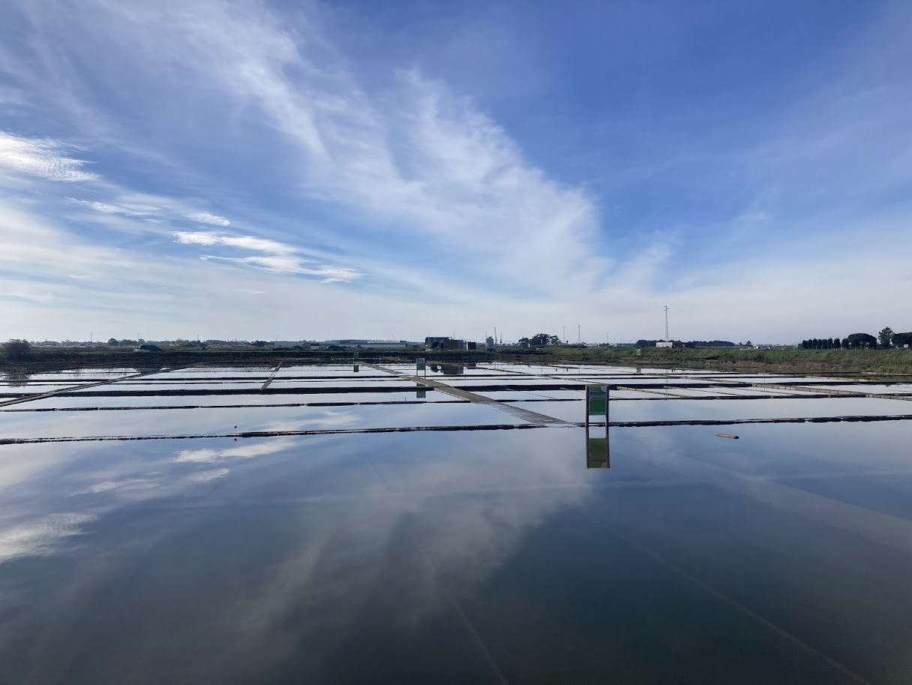
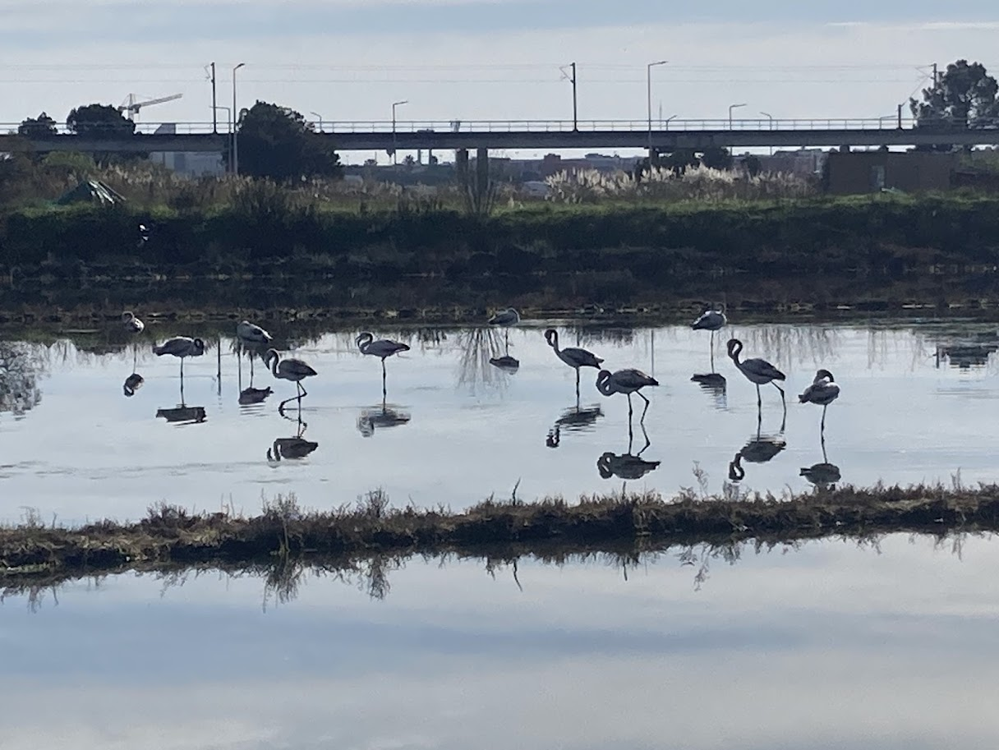
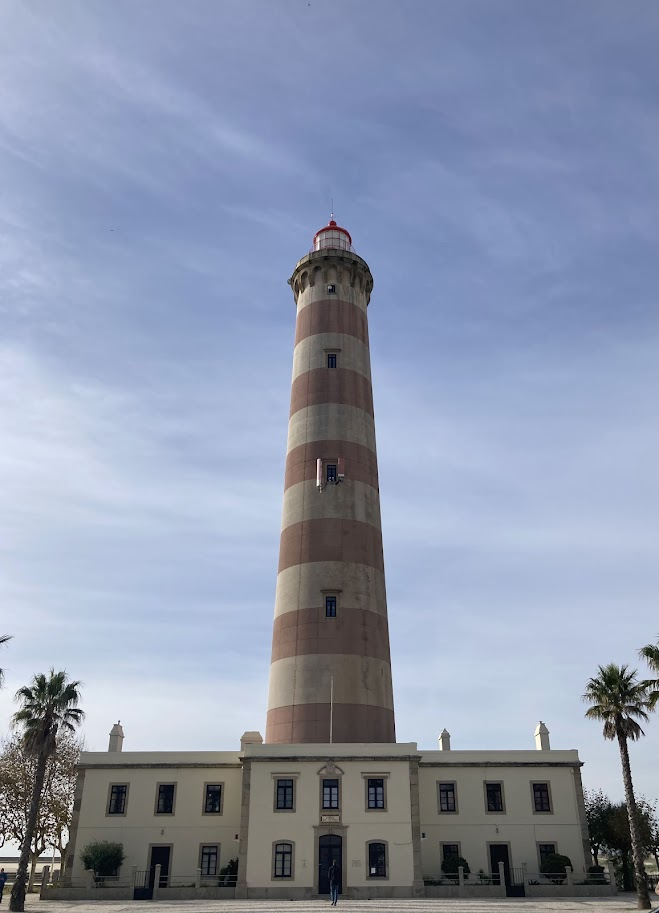
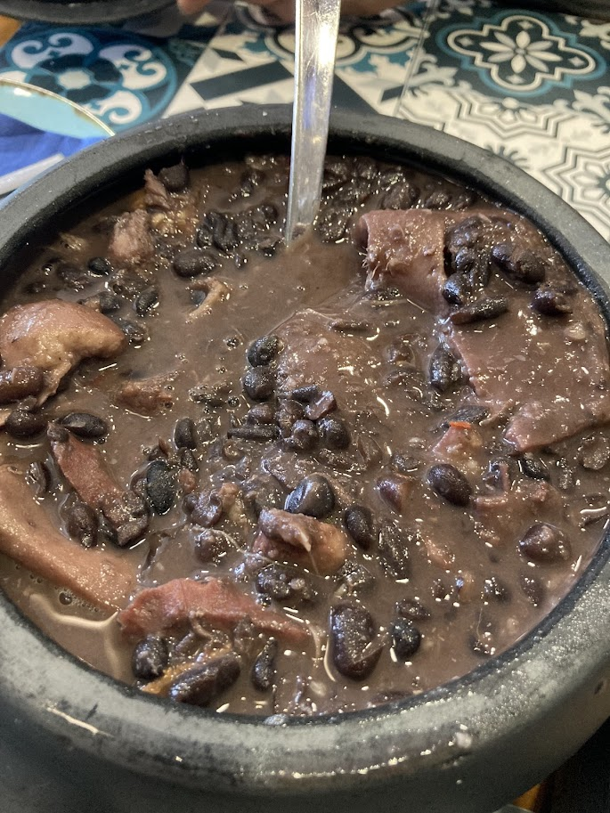

+++
date = '2025-12-02T16:11:50Z'
draft = true
title = 'Aveiro'
tags = ["jednodenní výlet"]
+++

Aveiro je město asi 70 km jižně od Porta, které je proslulé svými kanály. Kvůli nim se mu také přezdívá "portugalské Benátky".

Z Porta lze do Aveira dojet vlakem nebo autobusem. My jsme zvolili autobus, jede asi o 15 minut déle, ale je výrazně levnější.

## Centrum Aveira

Dopoledne jsme si vyhradili na procházku centrem města. Podél Canal Central vede krásná cyklostezka až na náměstí.
Až na kachličkové fasády budov Aveiro působí o dost jinak než ostatní portugalská města a spíš nám připomínalo Dánsko nebo Nizozemsko.

{{< carousel images="{img/nadrazi.jpg,img/aveiro3.jpg,img/aveiro6.jpg}" >}}

Z města jsme vyrazili k okolním solným pánvím, která jsou pro Aveiro taky typická.
V jednom z jezírek jsme viděli i skupinku plameňáků.


    
    


## Costa Nova

Poté jsme z Aveira dojeli autobusem k moři k majáku Farol da Barra.
Odtud jsme se prošli po pláži do nedaleké Costa Novy, která je známá svými barevnými pruhovanými domky.

Cestou jsme se zastavili na oběd v místní restauraci, kde jsme ochutnali tradiční brazilský pokrm Feijoada.
To je hustý fazolový guláš s různými druhy masa - v našem případě vepřovým masem, klobásou a vepřovými jazyky.

V porovnání s ostatními plážemi byla Costa Nova asi nejsvětlejší.
Většina cesty vede po dřevěných molech nad písečnými dunami, takže procházka byla příjemná.

{{< carousel images="{img/plaz.jpg,img/plaz2.jpg,img/domecky1.jpg}" >}}
