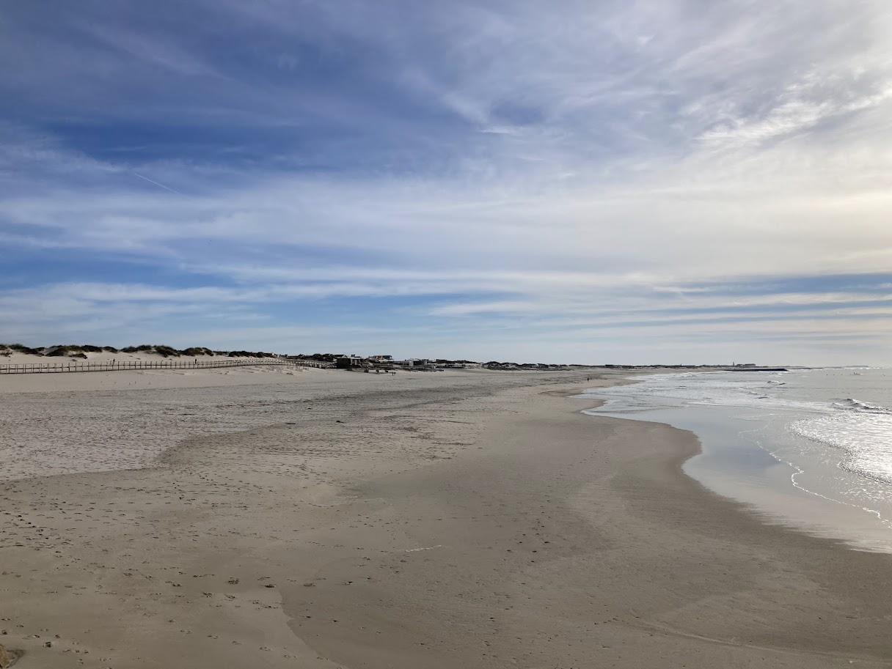
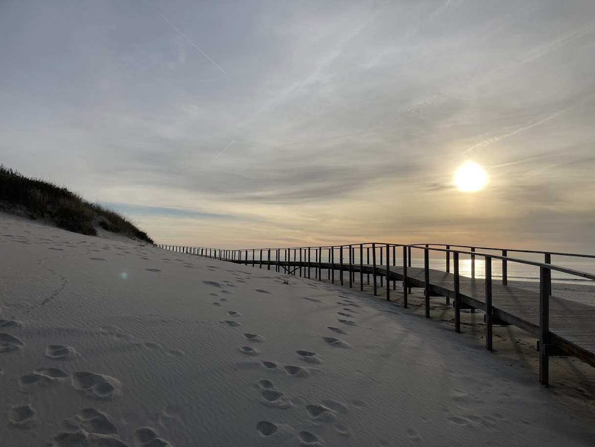
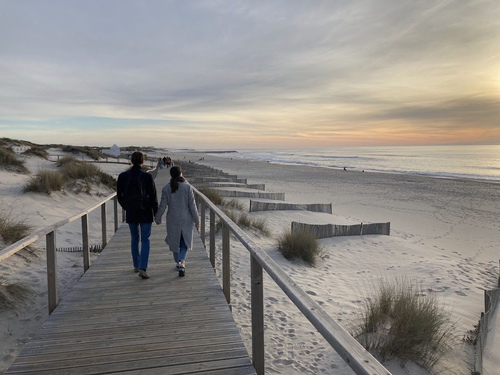

+++
date = '2025-12-02T16:11:50Z'
draft = false
title = 'Aveiro'
tags = ["jednodenní výlet"]
+++

Aveiro je přímořské město asi 70 km jižně od Porta, které je proslulé systémem kanálů. Díky němu se mu také přezdívá "portugalské Benátky".

Z Porta lze do Aveira dojet vlakem nebo autobusem. My jsme zvolili autobus, jede asi o 15 minut déle, ale je výrazně levnější.

## Centrum Aveira

Dopoledne jsme si vyhradili na procházku centrem města. Podél Canal Central vede krásná cyklostezka směrem k náměstí.
Až na kachličkové fasády budov Aveiro působí o dost jinak než ostatní portugalská města a spíš nám připomínalo Dánsko nebo Nizozemsko.

{{< carousel images="{img/nadrazi.jpg,img/aveiro3.jpg,img/aveiro6.jpg}" >}}

Z města jsme vyrazili k okolním solným pánvím, které jsou pro Aveiro taky typické.
V jednom z jezírek jsme dokonce viděli skupinku odpočívajících plameňáků.


    
    


## Pláže Barra a Costa Nova

Po návštěvě solných pánví jsme dojeli autobusem k nejvyššímu portugalskému majáku [Farol da Barra](https://en.wikipedia.org/wiki/Lighthouse_of_Praia_da_Barra).
Chtěli jsme vystoupat na vrchol majáku, ale bohužel je veřejnosti přístupný pouze 1 den v týdnu.
Místo toho jsme tedy rovnou vyrazili pěšky po pláži směrem k rybářské vesnici Costa Nova.

Cestou jsme se zastavili na oběd v místní restauraci, kde jsme ochutnali tradiční brazilský pokrm Feijoada.
To je takový fazolový guláš s různými druhy masa - v našem případě vepřovým masem, klobásou a hovězími jazyky.
Jídlo je to tak hutné a porce byla tak obrovská, že jsme snědli sotva třetinu porce.

Po obědě jsme pokračovali dál v procházce po plážích Barra a Costa Nova.
Většina cesty vedla po dřevěných molech nad písečnými dunami, takže procházka byla příjemná.
V porovnání s ostatními portugalskými plážemi je tu dost světlý písek.


    
    
    


Na závěr jsme se prošli ve vesnici Costa Nova, která je známá svými barevně pruhovanými domky.

{{< carousel images="{img/domecky1.jpg,img/domecky2.jpg,img/domecky3.jpg}" >}}

Při čekání na zpáteční autobus jsme si tu dali palačinku zvanou Tripa de Aveiro, což v překladu znamená v "aveirské dršťky".
Palačinka je tak [údajně](https://pt.wikipedia.org/wiki/Tripa_de_Aveiro) pojmenovaná kvůli její textuře.
