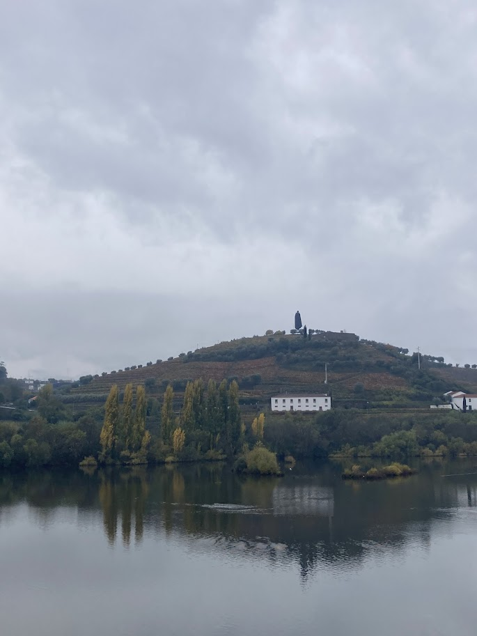
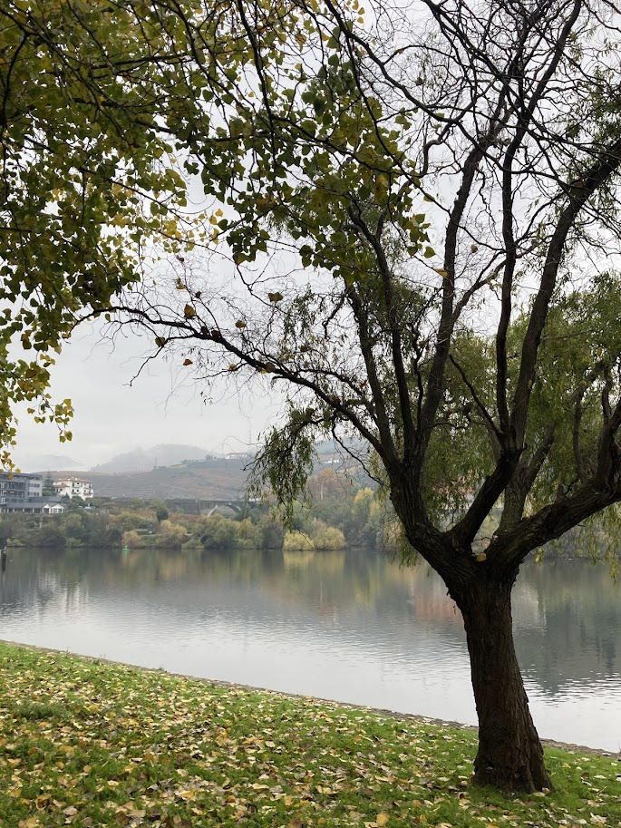
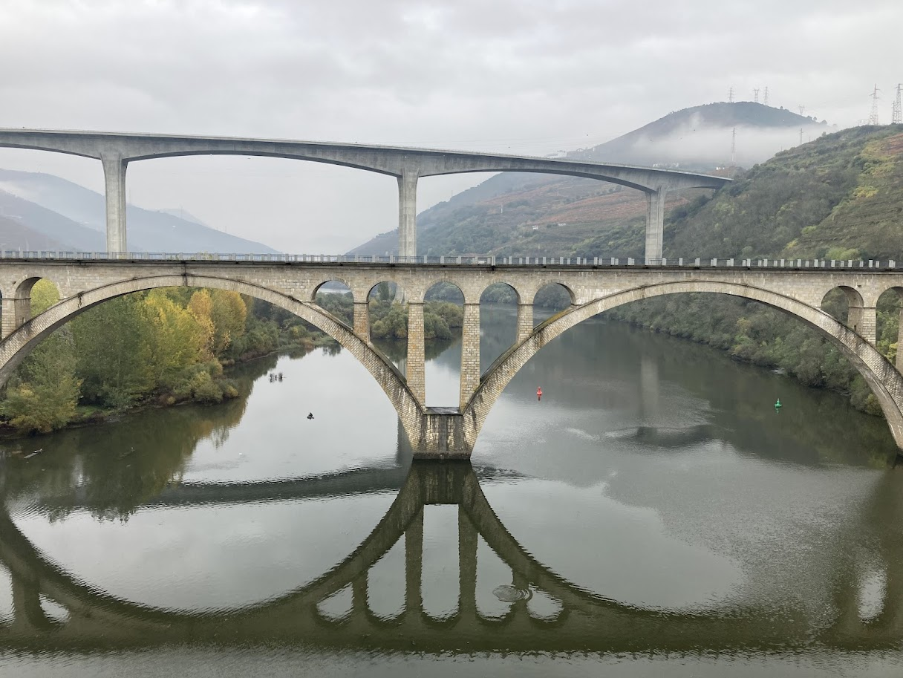
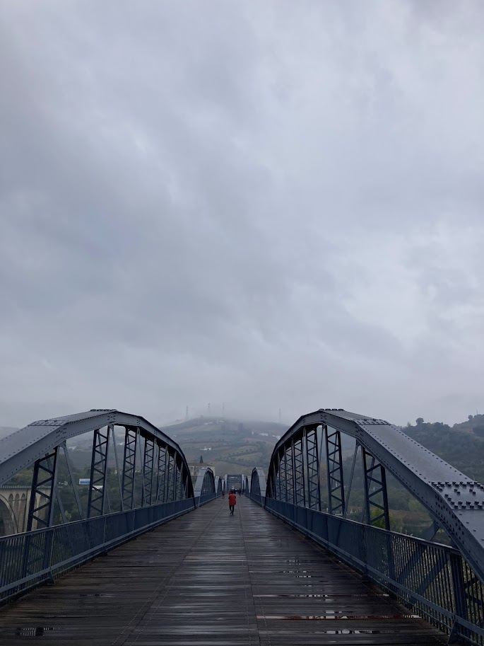
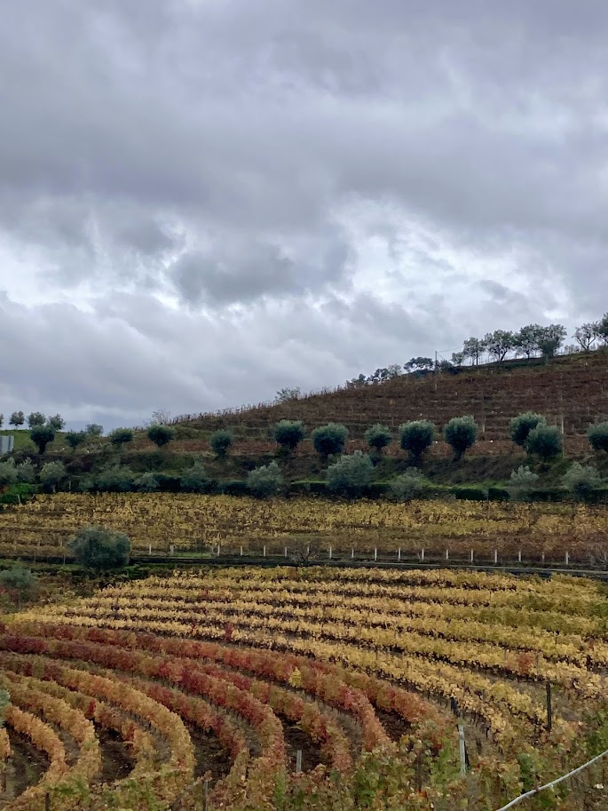
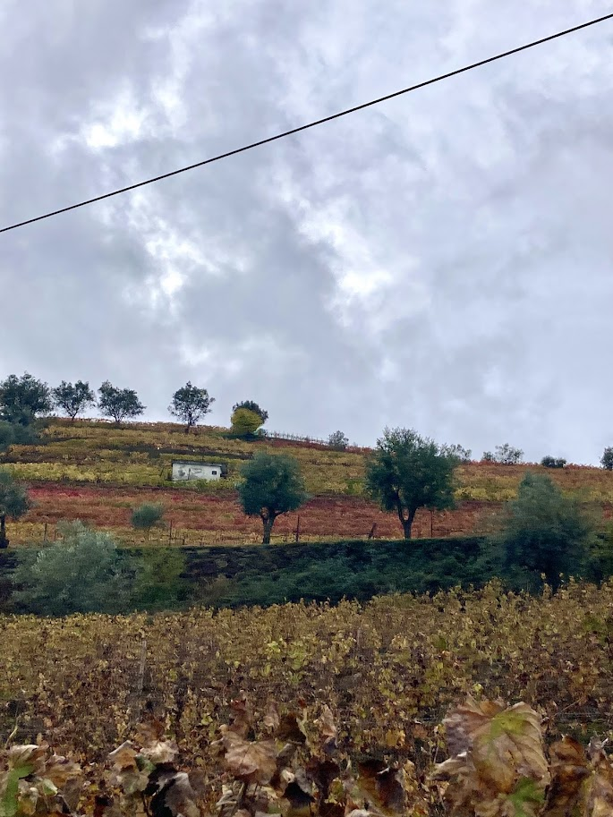
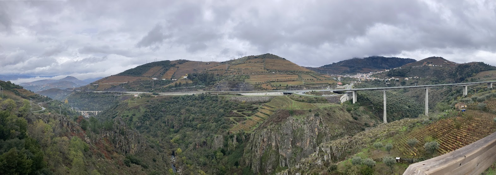
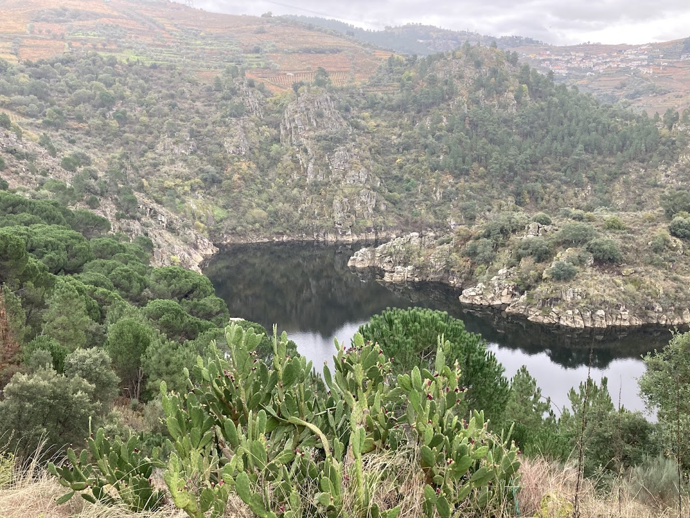
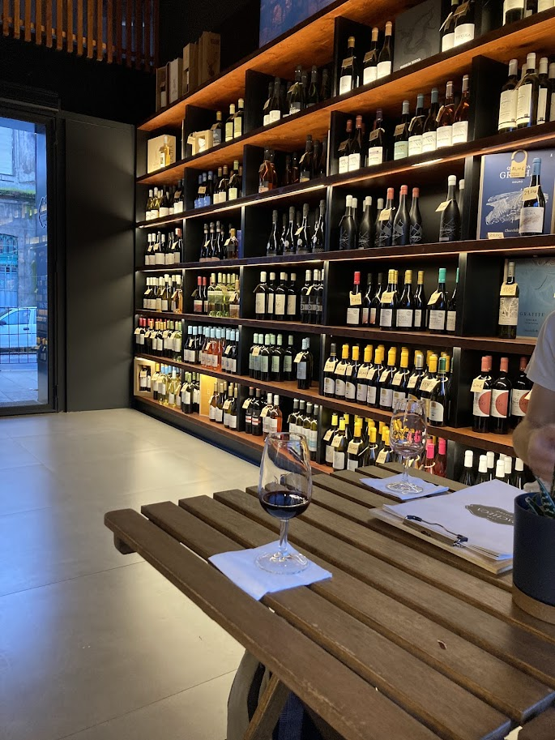

+++
date = '2025-11-29T20:25:48+01:00'
draft = false
title = 'Údolí řeky Douro'
tags = ['jednodenní výlet']
+++

[Údolí řeky Douro](https://www.visitportugal.com/en/content/douro-valley) je rozlehlá vinařská oblast v Portugalsku. Patří dokonce mezi světové dědictví UNESCO, proto jsme jeho návštěvu rozhodně nemohli vynechat. 

## Doprava

Při našem pobytu v Portugalsku jsme měli smůlu, protože tamější železnice měla zrovna dlouhodobou výluku, takže cesta do vinařské oblasti (do města Peso da Régua) vlakem a autobusem trvala asi 3 h. Za normálních okolností by měl do města [Peso da Régua](https://mapy.com/s/cecuveneza) nebo [Pinhao](https://mapy.com/s/lavojogene) jezdit z Porta [přímý spoj](https://www.cp.pt/en/). 

## Trasa



Naše cesta začínala krátkou procházkou kolem řeky Douro směrem k mostům přes ni.


  
  


Jen v Peso da Régua se nacházejí tři různé mosty - pro pěší, silniční a dálniční. 


  
  


Po tom, co jsme jeden z mostů přešli, jsme pokračovali podél údolí říčky [Rio Varosa](https://mapy.com/s/guzehezuzo) po části stezky [Caminho Português Interior](https://spiritofthecamino.com/caminho-portugues-interior-highlights/).

Stezku lemovaly vinice, ale i spoustu olivnovníků, eukalyptů a pomerančovníků.


  
  
  


Jelikož jsme tuto oblast navštívili na konci listopadu, víno už bylo sklizené, ale vinice měli krásné podzimní barvy.

{{< carousel images="{img/pomeranc.jpg,img/vyhled3.jpg,img/vyhled7.jpg,img/vyhled4.jpg,img/vyhled5.jpg}" >}}

V půlce cesty jsme dorazili k přehradě [Albufeira de Varosa](https://mapy.com/s/kejetafoha), která byla zdrojem vody pro vodní elektrárnu, kolem které jsme procházeli.

Jakmile jsme dorazili zpátky do města Pesoa da Régua, nemohli jsme vynechat ochutnávku vína. Vybrali jsme si podnik [Pacecha Bistro](https://maps.app.goo.gl/Ds6Cm118LrWWwGqW8) blízko autobusového nádraží. Ochutnali jsme zde desetileté portské ruby a portské tawny.

