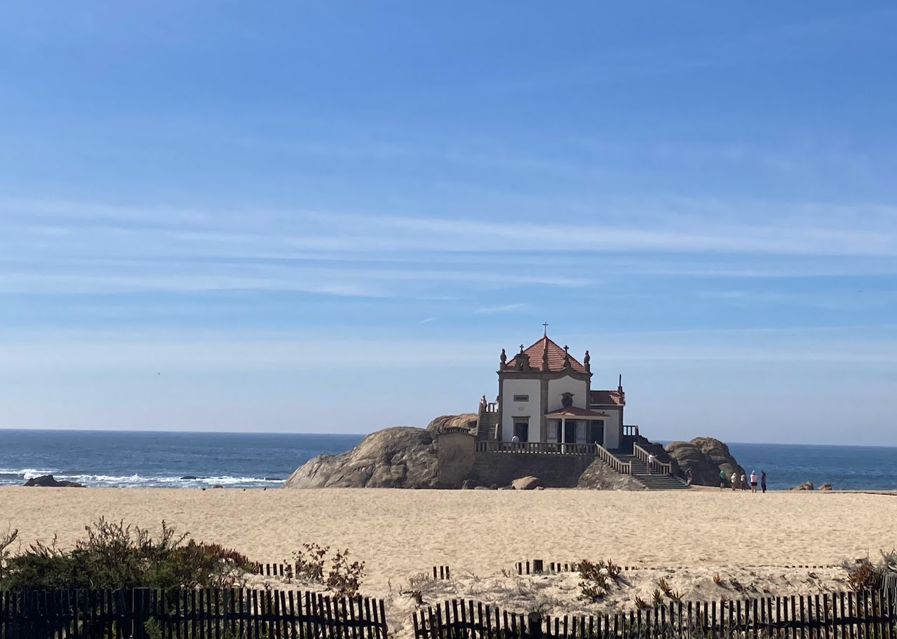
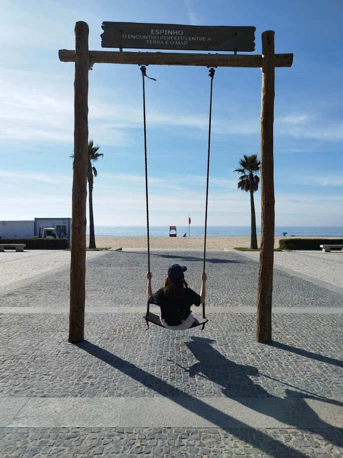
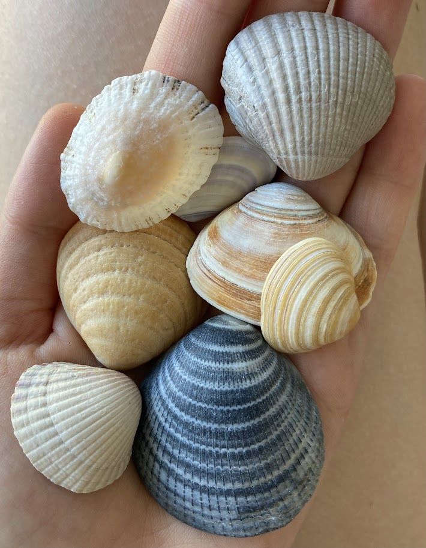

+++
date = '2025-10-11T12:48:55+01:00'
draft = true
title = 'Cesta po pobřeží do Espinha'
tags = ["jednodenní výlet"]
+++

Jelikož jsme ještě chtěli využít výhodného studentského jízdného [výhodného studentského jízdného](https://andante.pt/en/purchase/silver-andante/) po metropolitní oblasti, vydali jsme se na procházku po plážích na jih od Porta.

## Trasa

Nastoupili jsme ve stanici Porto-Campanhã a jeli asi půl hodiny do stanice Francelos. Odtud jsme došli k moři a dál jsme pokračovali na jih až do Espinha, odkud nám potom jel vlak zpátky do Porta. Trasa měla přibližně 10 km a byla úplně po rovině, takže se šlo krásně až na to, že na nás docela pařilo slunce.



## Pláže

Cesta vedla po dřevěných molech postavených podél písečných pláží, které byly skoro bez lidí. 

Taky jsme cestou narazili na několik přírodních ["mini rezervací"](https://parquebiologico.pt/parque-dunas-da-aguda), kde byly písečné duny porostlé sukulenty a jinou zelení. Duny jsou tam chráněné, protože tvoří přirozenou bariéru proti erozi pobřeží a rozšiřování oceánu do vnitrozemí. Slouží i jako oblast pro hnízdění ptáků. 

{{< carousel images="{img/molo.jpg,img/sukulenty.jpg,img/molosBenym.jpg}" >}}

## Capela do Senhor da Pedra

V první části trasy jsme navštívili krásnou kapličku postavenou na útesech.

## Espinho

V Espinhu jsme si stihli projít akorát pláže, protože už nám jel brzo vlak. Pláž tam byla taky moc hezká se spoustou škebliček a velkými vlnami, takže jsme si říkali, že by to bylo i fajn místo na surfování.


  
  


*video vlny*