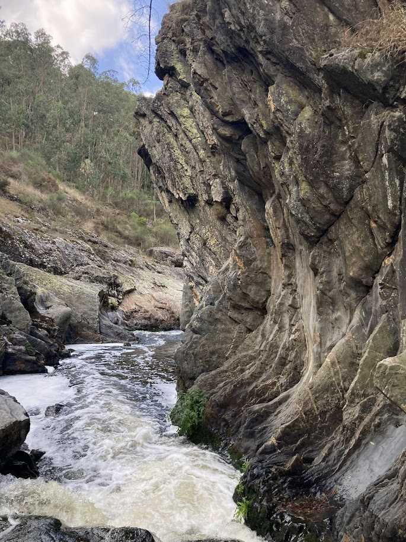

+++
date = '2025-10-02T19:28:11+01:00'
draft = true
title = 'Parque das Serras do Porto'
+++

Chráněná oblast Parque das Serras do Porto se nachází kousek na východ od Porta. Je to ideální na výlet, pokud si chcete na chvíli odpočinout od města a vyrazit do přírody.

## Cesta z Porta
Do parku se dá do dostat ze stanice Porto-Campanhã příměstských vlakem zhruba za 20 min. My jsme jeli do stanice São Martinho do Campo. Zpětně by asi bylo lepší vystoupit už ve stanici Valongo, ze které vedla do parku lepší cesta.

Zpětně jsem koukala, že se tam dá dostat i autobusem, pro případ, že byste chtěli vyrazit z jiných [výchozích bodů](https://serrasdoporto.pt/enquadramento/).



## c

Naše trasa začínala okolo řeky Ferreiry, kterou lemovaly krásné skály a hned na začátku nás čekalo pořádné stoupání.

