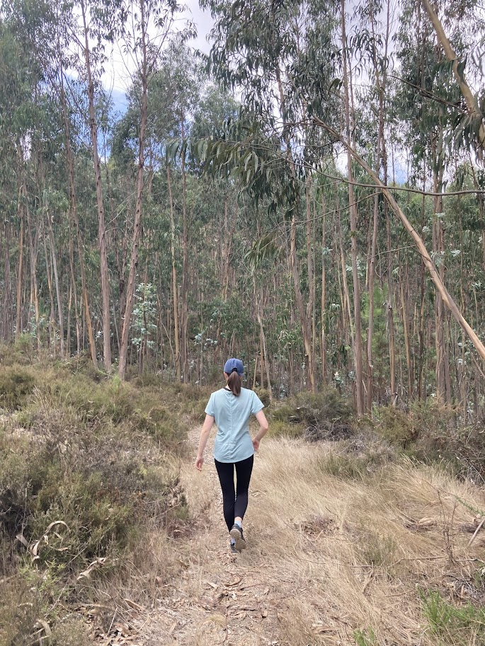
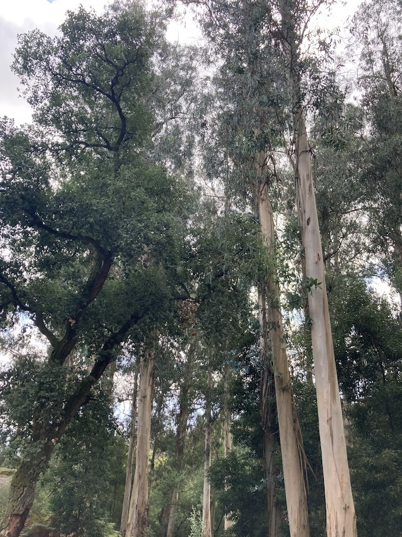
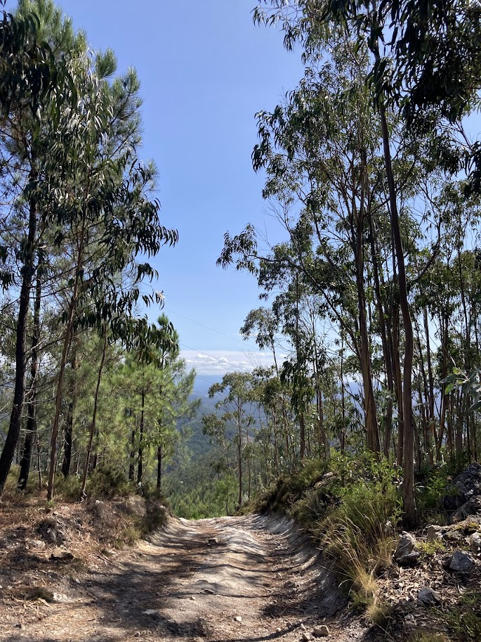
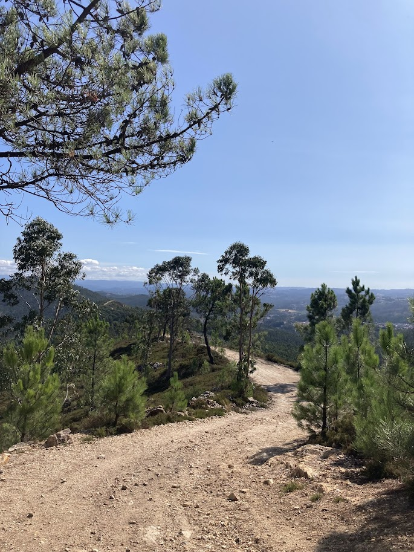
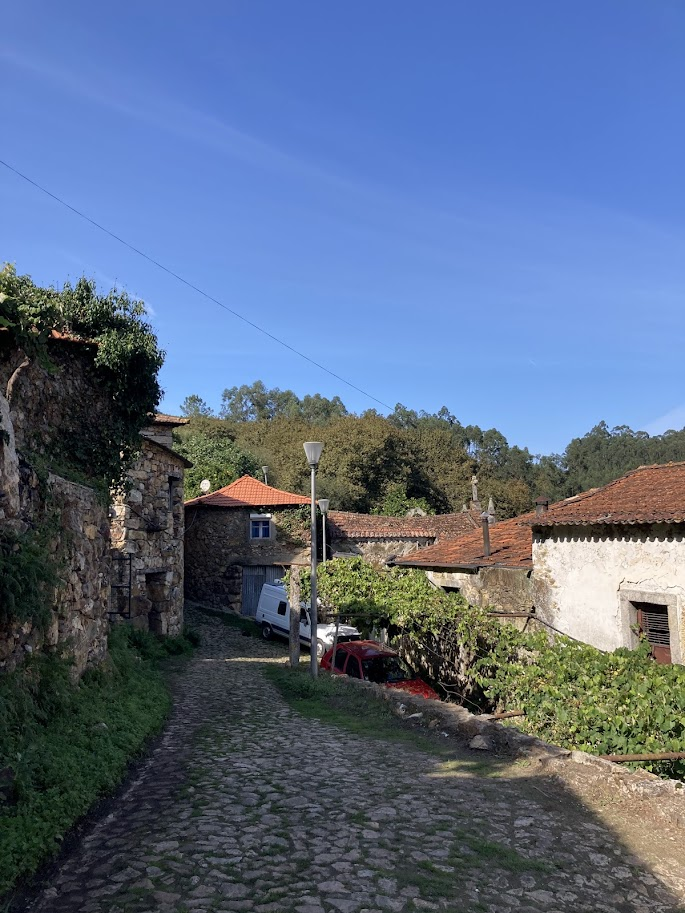

+++
date = '2025-10-02T19:28:11+01:00'
draft = true
title = 'Parque das Serras do Porto'
tags = ["jednodenní výlet"]
+++

Chráněná oblast Parque das Serras do Porto se nachází kousek na východ od Porta. Je to ideální na výlet, pokud si chcete na chvíli odpočinout od města a vyrazit do přírody.

## Cesta z Porta
Do parku se dá do dostat ze stanice Porto-Campanhã příměstských vlakem zhruba za 20 min. My jsme jeli do stanice São Martinho do Campo. Zpětně by asi bylo lepší vystoupit už ve stanici Valongo, ze které vedla do parku lepší cesta.

Zpětně jsem koukala, že se tam dá dostat i autobusem, pro případ, že byste chtěli vyrazit z jiných [výchozích bodů](https://serrasdoporto.pt/enquadramento/).



## Park

Naše trasa začínala okolo řeky Ferreiry, kterou lemovaly krásné skály a hned na začátku nás čekalo pořádné stoupání.

Hned vstupu do parku jsme si začli všímat, že okolní les krásně voní. V lese totiž rostly hlavně eukalypty, kterými byl nakonec tvořen téměř celý park.


  
  
  


Když jsme vystoupali na kopec Santa Justa (374 m n.m.), otevřel se nám výhled na údolí řeky Ferreiry a na druhé straně i výhled na Porto.

{{< carousel images="{img/santajusta.jpg,img/vyhled porto.jpg,}" >}}

Pak jsme po hřebeni pokračovali dál ještě pár kilometrů a zklesali až do vesničky Couce. 

Couce se ukázalo být malebná vesnička s románskými kořeny. Okolo ní byl už trochu pestřejší les i s jinými stromy než eukalypty a také několik ohrádek s hospodářskými zvířaty.

Z Couce už vedla jen příjemná asfaltka po rovině až zpátky do Valonga, kde jsme nasoupili na vlak zpět do Porta.

