+++
date = '2025-10-10T19:20:13+01:00'
draft = true
title = 'Sao Miguel'
tags = ['týdenní výlet']
+++

Sao Miguel je největší a nejlépe přístupný ostrov Azorských ostrovů.

Z Porta na Sao Miguel (Ponta Delgada) 3 dny v týdnu létá společnost Ryanair.
Na 6 dní jsme se zvládli sbalit do příručního zavazadla, takže jsme ušetřili za odbavené zavazadlo.
Zpáteční letenky nás vyšly na 82.5 EUR na osobu.

## Ubytování

Ubytování jsme našli přes Booking ve městě Vila Franca do Campo, které je asi 20 minut jízdy po dálnici od letiště.

## Auto

Rozhodně bych doporučil půjčit si na letišti auto, ostrov je dost členitý a silnice jsou v dobrém stavu.
My jsme si půjčovali u [Go Rent a Car](https://www.gorentacar.pt/en/).
Fiat Panda nás vyšel na 158.5 EUR na 6 dní (včetně 72 EUR pojistky bez spoluúčasti).

## První den: Jezírka východně od Sete Citades

Náš let trval z Porta něco málo přes dvě hodiny a na letiště Ponta Delgada jsme dorazili dopoledne, takže jsme si zašli pro auto a rovnou jsme vyrazili na první výlet.

Jelikož byl poměrně hezký den, mířili jsme na západ na trek kolem jezírek v oblasti Sete Citades.

Cestou jsme se ještě stavili na kávu a oběd. Oba podniky, co jsme navštívili, vypadaly zvenku trochu pochybně - měly místo dveří korálky nebo před nimi hráli místní důchodci domino. U obou nás ale jídlo mile překvapilo. Například portugalská [bifana](https://en.wikipedia.org/wiki/Bifana), kterou jsme ochutnali ve snackbaru [Rei das Bifanas](https://maps.app.goo.gl/xT5doPGQUXpc6mTF7) ve vesničce Feteiras, byla opravdu luxusní.

Naše další zastávka po cestě byla asi na nejprofláklejším výhledu [Vista do Rei](https://mapy.com/s/natepumuca), kde jsme téměř nemohli zaparkovat.

Pak už jsme jen kousek popojeli a zaparkovali na parkovišti u [akvaduktu do Carvão](https://mapy.com/s/fujebujete) a vyrazili na 6 kilometrový trek. 



Už na parkovišti byla dost mlha a jakmile jsme vyrazili nahoru, bylo to ještě horší, takže jsme na začátku z výhledů neviděli skoro nic. I tak ale byla okolo úplně krásná zeleň, takže jsme si procházku užili i v mlze.

{{< carousel images="{img/1_akvadukt.jpg,img/1_mlha.jpg,img/1_hortenzie.jpg,img/1_cesta.jpg,img/1_zelen.jpg}" >}}

Nejprve jsme míjeli [jezero Rasa](https://mapy.com/s/revebalage), které bylo v nížině a potom jsme stoupali nahoru k jezírkům [Lagoa das Eguas sul](https://mapy.com/s/letodeboge) a [Lagoa das Eguas norte](https://mapy.com/s/gocagojaco), které nás naprosto uchvátily. 

Na začátku jsme teda nic neviděli, protože byla mlha, ale stačilo pár minut počkat a výhled byl opravdu nádherný. Čekání na to, než přejde mlha, se pak na Azorech stalo téměř pravidlem. 


  
  


Dál jsme pokračovali po hřebeni kolem [Lagoa das Eguas norte](https://mapy.com/s/gocagojaco), odkud byl krásný výhled na sever ostrova, kde už bylo jasno.

{{< carousel images="{img/1_norte.jpg,img/1_norte_hreben.jpg,img/1_vyhledsever.jpg,img/1_haros.jpg}" >}}

Z hřebene vedla lesní cesta, která navazovala na cestu obklopenou hortenziemi. Většina hortenzií už byla sice odkvetlá, ale i na začátku října se našlo pár, které ještě kvetly.


  
  


Cesta obklopená hortenziemi byla ale mimo naši naplánovanou trasu a končila slepě,  takže jsme k autu museli sejít z kopce po louce a po silnici. 

Po cestě na ubytování jsme se ještě zastavili na krátkou zastávku na útesech na severu, kde je [Tromba do elefante](https://mapy.com/s/jalugudalo), což je známý útes ve tvaru slona. 

{{< carousel images="{img/1_slon.jpg,img/1_utesy.jpg,}" >}}

Cesta na ubytování byla ale ještě dobrodružná. Jeli jsme po severním břehu, až jsme dorazili do městečka [Rabo de Peixe](https://mapy.com/s/nukonefuba). Uprostřed města byla ale najednou hlavní silnice uzavřená zákazem vjezdu. Rozhodli jsme se to teda objet po vedlejší, kde žádný zákaz nebyl, ale vjeli jsme přímo do centra jakýchsi oslav a pěší zóny, takže jsme to museli dost zdlouhavě vycouvávat a objíždět celé město.

Později jsme dohledali, že tam zrovna probíhali slavnosti [Festa de Nossa Senhora do Rosário](https://www.facebook.com/groups/acores.global/permalink/24759099977114183/), tedy slavnosti Panny Marie Růžencové, což je patronka tohoto rybářského městečka. To, na co jsme narazili byl pravděpodobně Cortejo Recolha das Ofertas, v doslovném překladu Průvod pro sbírku obětních darů, kdy místní prochází vyzdobeným městem a nesou sošku Panny Marie.

## Druhý den: Střední část ostrova

Prvním cílem našeho druhého dne bylo [Lagoa do Fogo](https://mapy.com/s/kabavazepa), které se nachází v pohoří ve středu ostrova. Vyráželi jsme z ubytování za krásného slunce, ale jakmile jsme vyjeli jenom do trochu vyšší nadmořské výšky, byla okamžitě hustá mlha a bylo nám jasné, že nic moc z jezera neuvidíme. 

Zaparkovali jsme na [parkovišti](https://mapy.com/s/lapehubapa) u výhledu na jezero, ale přes mlhu jsme si ani nebyli jistí, jestli tam jezero vůbec je. K jezeru jsme z výhledu sesoupili krátkou, ale dost prudkou [cestičkou](https://mapy.com/s/gedozopefo). 


  
  


Jezero jsme spatřili až když jsme sestoupali úplně dolů k němu. Pokračovali jsme ještě kousek podél pláže, ale výhledy stále nebyly nic moc.

Delší procházku kolem jezera jsme teda vzdali a vystoupali zpátky k autu. Nahoře nakonec mlha trochu ustoupila a jezero se nám na chvíli ukázalo.

Dál jsme se vydali směrem k vodopádům a termálům [Caldeira Velha](https://mapy.com/s/delezotodo), kde byl původní plán se vykoupat, ale měli volná místa až za hodinu a nám se nechtělo čekat, takže jsme se tam nakonec nepodívali. 

[Caldeira Velha](https://mapy.com/s/delezotodo) jsou jinak termály, které obklopuje krásná příroda a vodopády. Cenově vycházely s koupáním na [10 euro](https://parquesnaturais.azores.gov.pt/en/parques/9/centro/21/horarios). 

Další místo, které jsme navštívili, bylo v okolí vesničky [Porto Formosa](https://mapy.com/s/fapobusavu). Šli jsme tam krátký okruh okolo vodopádu a útesů.



Naše trasa začínala u vodopádu [Cascata do Porto Formosso](https://mapy.com/s/komuduvebu), který nás hodně překvapil. Původně jsme totiž na toto místo jeli hlavně kvůli útesům kolem moře a vodopád nebyl náš hlavní cíl. 

Vodopád ale působil fakt hezky, protože v něm byl dostatek vody a v jeho okolí byla krásná "džungle" a spousta hortenzií. Pod vodopádem bylo i malé jezírko, kde se dalo vykoupat, což nás nalákalo a příjemně jsme se v něm osvěžili.

{{< carousel images="{img/2_portoformosso_vodopad.jpg,img/2_okoli_vodopadu.jpg,img/2_hortenzie.jpg}" >}} 

Trasa vedla dál k pobřeží a útesům. Prošli jsme džunglí, bambusovou stezkou, pak po pastvinách kolem krav a býků v dost těsné blízkosti a dorazili jsme k [rozhledně](https://mapy.com/s/mamarufeje), odkud bylo vidět na skalní bránu v moři. 


  
  


Pak už jsme pokračovali podél moře směrem zpátky k vesničce. Cestou jsme míjeli další krásné útesy a pláž.

{{< carousel images="{img/2_utesy.jpg,img/2_plaz.jpg,}" >}}

Naše trasa směřovala dál k výrobně čaje [Chá Gorreana](https://mapy.com/s/jozofegeme), okolo které se rozkládají čajové plantáže. Čajové plantáže [Chá Gorreana](https://gorreana.pt/en/) jsou nejstaršími dosud fungujícími čajovými plantážemi v Evropě a v provozu jsou od roku 1883. Zajímavé je, že výrobna čaje zůstává vlastněná rodinou původních majitelů. Plantáže jsou tvořeny malými stromky čajovníku čínského ([Camellia sinensis](https://www.inaturalist.org/taxa/123005-Camellia-sinensis)), jehož lísky se sklízejí v období mezi dubnem a říjnem a potom se z něj vyrábí 3 typy čajů - zelený, černý a oolong. 

Zaparkovali jsme přímo u výrobny čaje, kde nebylo moc místa, ale měli jsme štěstí a nějaké jsme našli. Pak jsme šli krátký trek okolo čajových plantáží a vedlejšího vodopádu [Salto da Cidreira](https://mapy.com/s/fuvasakopa).



Plantáže byly krásně upravené a rozlehlé. Na hlavní cestě bylo docela dost lídí, ale když jsme trochu poodešli od parkoviště, už tam nebyl skoro nikdo. 

{{< carousel images="{img/2_plantaz2.jpg,img/2_plantaz3.jpg,img/2_lilie.jpg,img/2_plantaz4.jpg,img/2_plantaz5.jpg}" >}}

Po okruhu kolem plantáže jsme se vydali ještě na vodopád [Salto da Cidreira](https://mapy.com/s/fuvasakopa), protože byl relativně kousek a přišla nám škoda se k němu nepodívat. Cesta k němu vedla podél akvaduktu a říčky, která zásobovala vodní nádrž vedle výrobny čaje.

Cesta k vodopádu byla sice moc hezká, ale vodopád už tolik ne. 


  
  


Když jsme se vrátili na parkoviště, měli jsme v plánu jít ještě na prohlídku výrobny čaje, ale byli jsme dost unavení, tak jsme nakonec navštívili jen suvenýry a koupili si azorský čaj.

Při zpáteční cestě na ubytování jsme se ještě rozhodli si udělat zastávku u jezera [Lagoa do Congro](https://mapy.com/s/kabegofodu), kolem kterého jsme jeli. Cesta na [parkoviště](https://mapy.com/s/mukodahelo) z hlavní silnice byla po dost blátivé a rozježděné cestě. K jezeru se pak dalo sejít po ještě blátivější [cestičce](https://mapy.com/s/jovupedohu).


  
  


Kolem jezera [Congro](https://mapy.com/s/kabegofodu) byly krásné vysoké stromy, které voněly jako vavřín. Mlha dodávala okolí jezera zajímavou atmosféru. 

")

## Třetí den: Severovýchod

Třetí den ráno jsme se vydali na procházku ke kapličce [Ermida de Nossa Senhora da Paz](https://mapy.com/s/leperopago). Šli jsme pěšky z našeho ubytování, což bylo poměrně kousek, ale taky dost do kopce. Po cestě jsme míjeli několik polí s banánovníky a krásné výhledy na moře a ostrov [Ilhéu de Vila Franca](https://mapy.com/s/rebumujece).


  
  


")

")

Odpoledne jsme se vydali na severovýchod ostrova na trek ke dvěma vodopádům - [Salto da Farinha](https://mapy.com/s/bamadubudu) a [Cascata do Risco](https://mapy.com/s/bajupevaba).



Parkovali jsme kousek od vodopádu [Salto da Farinha](https://mapy.com/s/bamadubudu), kam se sice dalo dojet autem, ale k parkovišti vedla dost strmá silnice, takže příště bysme asi auto nechali už na dřívějším parkovišti.

")

Původně jsme teda chtěli jsme dojít až k vodpádu [Cascata do Risco](https://mapy.com/s/bajupevaba), ale první vodopád byl celkem vyschlý, takže jsme došli jenom k [Poço Azul](https://mapy.com/s/baselarazo) a cestu ke druhému vodopádu jsme nakonec vzdali.

Trasa byla jinak docela pěknou přírodou, až na to, že část vedla po silnici a celkově měla trasa docela velké převýšení, takže se výlet tolik nepovedl. Musím ale ocenit [lilie](https://www.inaturalist.org/taxa/61827-Amaryllis-belladonna), které lemovaly silnici.

Pak jsme popojeli kousek dál východně k [Parque Natural dos Caldeiroes](https://mapy.com/s/nabuzujaka), kde jsme si udělali krátkou procházku kolem umělé kaskády vodopádů, které tečou nehledě na roční období. V parku se taky nachází pět původních mlýnů z 16. století. Kvůli snadné dostupnosti místa a působivým vodopádům tam bylo docela dost lidí, ale návštěva myslím stála za to. 


  
  
  


Na večer jsme dojeli na úplný východ ostrova k majáku [Farol do Arnel](https://mapy.com/s/fudokakebo). Prvně jsme sestoupali až k němu, ale hezčí vyhlídka [Miradouro da Vista dos Barcos](https://mapy.com/s/huvuvumecu) byla až o kousek dál, kam jsme popojeli autem.


  
  


" )

##  Čtvrtý den: Sete Citades

Čtvrtý den jsme se vydali na nejznámnější trek na ostrově Sao Miguel - a to kolem jezer [Sete Citades](https://mapy.com/s/nanodadudu). 



Sete Citades je městečko na západě ostrova mezi dvěma jezery - [Lagoa Azul](https://mapy.com/s/bokunecaza) a [Lagoa Verde](https://mapy.com/s/papajetaze). [Lagoa Azul](https://mapy.com/s/bokunecaza) má modrou barvu, protože odráží oblohu a [Lagoa Verde](https://mapy.com/s/papajetaze) je zelené, protože odráží okolní hory.

Všechna jezera leží na ploše masivního polygenetického vulkánu Sete Citades, který má plochu asi 110 km$^2$. Polygenetické vulkány mají složitější strukturu, protože jejich erupce proběhla v minulosti několikrát, narozdíl od monogenetických vulkánů, které v minulosti vybuchly jenom jednou a přestaly být aktivními. Vulkanický masiv Sete Citades je velmi členitý a tvoří ho různé vulkanické struktury a 4 jezera. Jeho poslední erupce se datuje na rok 500 n.l., čímž vznikla [Caldeira Seca](https://maps.app.goo.gl/5YFP3iNy373syFko6).

Náš trek začínal na parkovišti u [akvaduktu](https://mapy.com/s/lulorefajo), kolem kterého se pásly krávy. Díky mlze zde byla opravdu krásná atmosféra.


  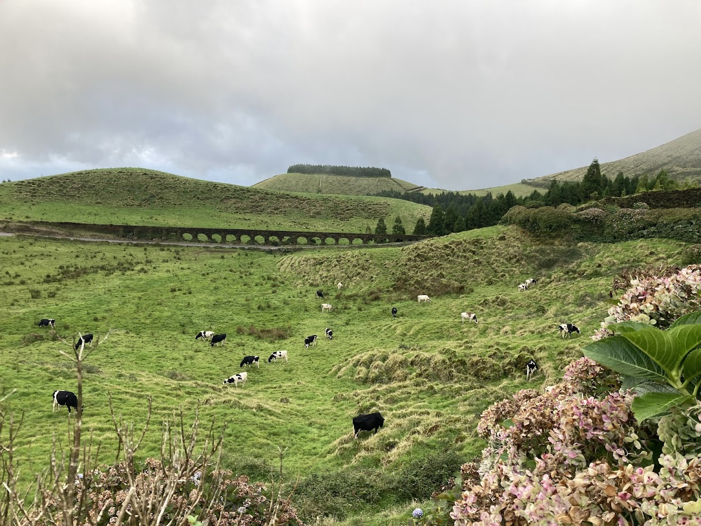
  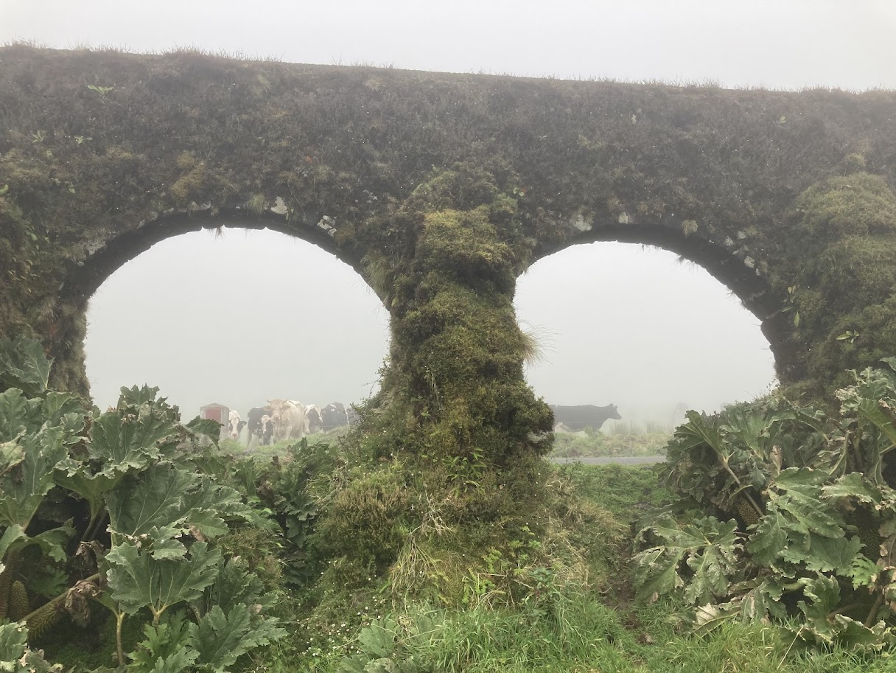


Část akvaduktu se nazývá The wall of nine windows. Původní akvadukt pochází z 17. století a odváděl vodu z oblasti kolem [Lagoa do Canario](https://mapy.com/s/gebugotese) do hlavního města ostrova [Ponta Delgada](https://mapy.com/s/puveresejo). 

Dál jsme pokračovali po cestě směrem k hoře [Pico da Cruz](https://mapy.com/s/habukalete) a po hřebeni kolem jezer. Cesta byla nádherná, i když na začátku jsme se opět báli, že kvůli mlze vůbec nic neuvidíme.

" )

Pak se ale vyjasnilo a byl krásný pohled jak na jezera, tak na na opačnou stranu na louky a oceán.

{{< carousel images="{img/4_panorama_zacatek.jpg,img/4_cesta.jpg,img/4_jezero1.jpg,img/4_ocean.jpg}" >}}

Na severozápadní straně pak byly z dálky dokonce vidět útesy [Ilhéus dos Mosteiros](https://mapy.com/s/cekuhajeja), které jsme navštívili poslední den. 

" )

Na jižní straně se pak nacházely nezatopené krátery a pole...
{{< carousel images="{img/4_pole.jpg,img/4_policka.jpg}" >}} 

...a kopce a spousta krav


  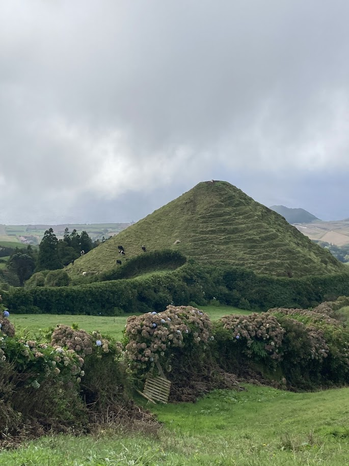
  


Pak jsme míjeli známý výhled [Vista do Rei](https://mapy.com/s/natepumuca), ale náš nejoblíbenější [výhled](https://mapy.com/s/hogusujumo) byl u zídky podél silnice ještě o kousek dál.

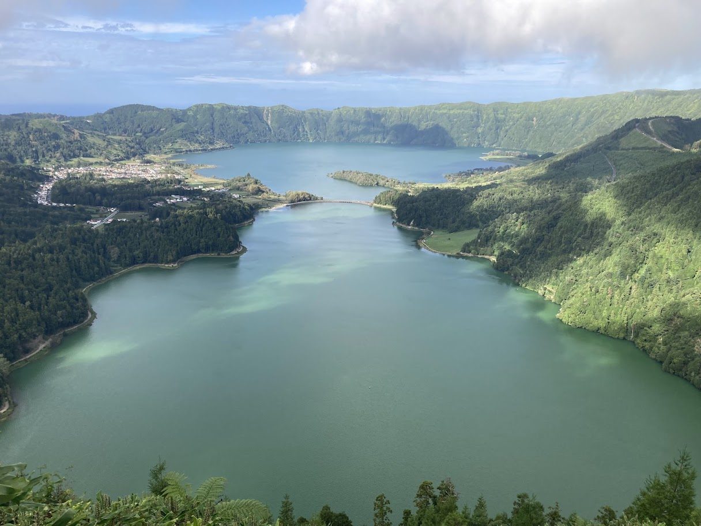

Trasa pokračovala po silnici, což nebylo uplně příjemné. Chtěli jsme totiž zajít na poslední výhled [Boca do Inferno](https://mapy.com/s/nopupuhehe), odkud bylo možné zahlédnout i zbylá jezera, která jsme dosud neviděli. Na tento výhled odbočovala ze silnice neznačená, ale pěkná cesta. 


  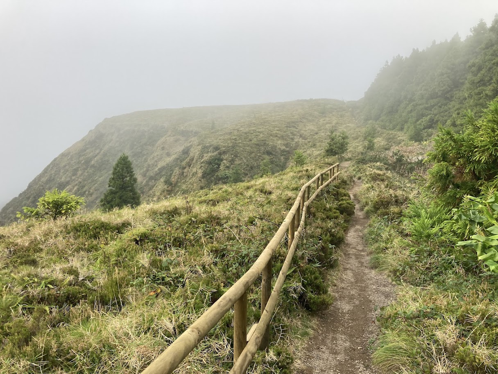
  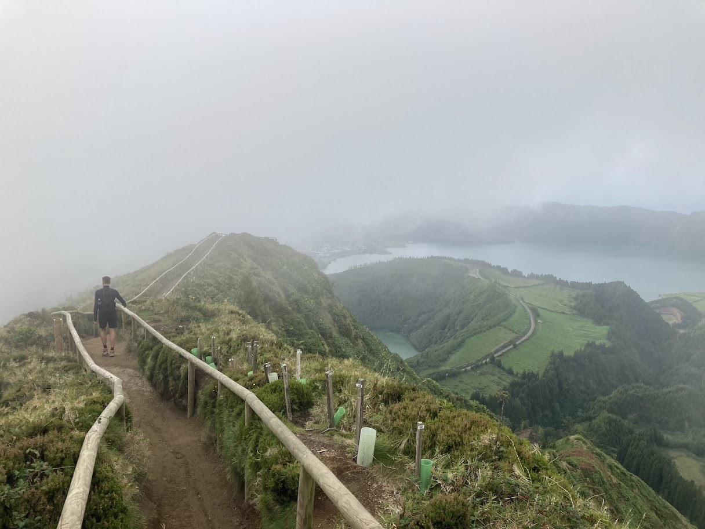


Z výhledu [Boca do Inferno](https://mapy.com/s/nopupuhehe) na parkoviště ale už vedla pěkná upravená cesta jakýmsi parkem.

## Pátý den: Furnas

Pátý den jsme vyrazili do vulkanické oblasti v okolí městečka Furnas na východě ostrova.
Ráno jsme zamířili na procházku okolo [Lagoa da Furnas](https://mapy.com/s/mohohuhuma).



Procházka byla krásná, ani nám nevadilo vracet se zpět na parkoviště po silnici.

{{< carousel images="{img/5_kostel.jpg,img/5_odpočinek.jpg,img/5_prales.jpg}" >}}

Na procházce jsme viděli i přípravu místní speciality [Cozido das Furnas](https://byacores.com/en/cozido-das-furnas/).
To je směs zeleniny a masa vařená v hrncích zakopaných v blízkosti geotermálních pramenů. [Cozido das Furnas](https://byacores.com/en/cozido-das-furnas/) jsme ale nakonec neochutnali, protože bylo dost drahé a bylo potřeba si ho předem rezervovat v restauraci. Vůně podobná svíčkové byla ale cítit, i když jsme jen šli kolem.

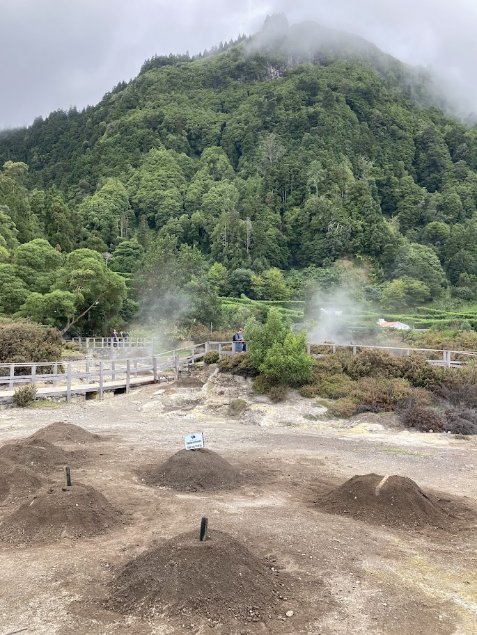

U geotermálních pramenů byl i [Grená Park](https://mapy.com/s/fafahenebu), který jsme nakonec vynechali, protože se nám nechtěl platit vstup. Navíc z dálky vypadalo, že vodopády v parku moc netečou a ještě jsme toho ten den chtěli hodně stihnout.

Po procházce jsme přejeli do Furnasu, kde jsme zaparkovali [na kraji města](https://mapy.com/s/hogaronejo) a pak se prošli do centra a k parku s geotermálními prameny [Courela Garden](https://mapy.com/s/rezehataba).

" )

Centrum Furnas bylo moc pěkný a obklopený krásnýma zelenýma kopečkama.


  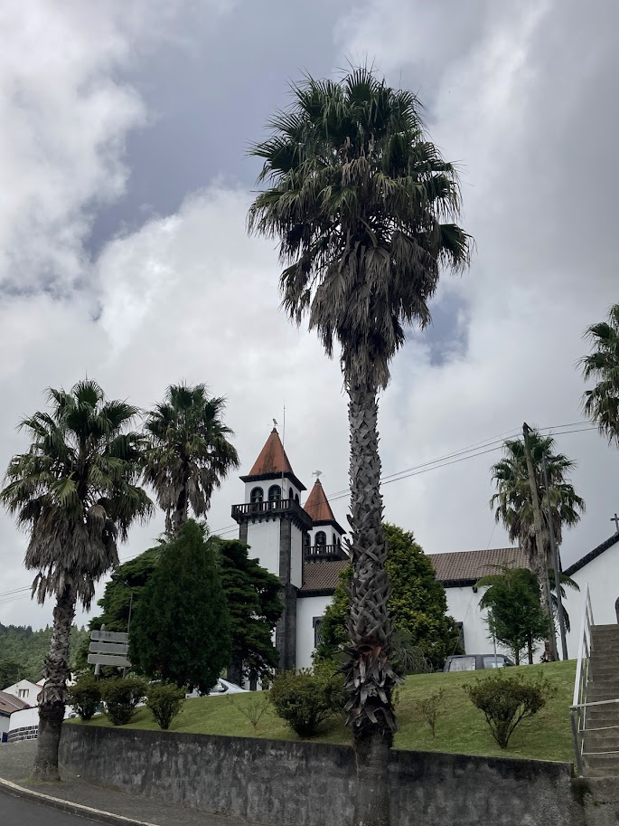
  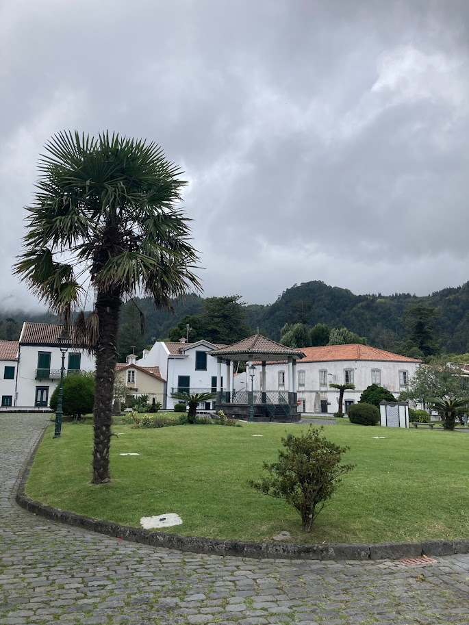


V centru jsme taky narazili na zvláštní domek.

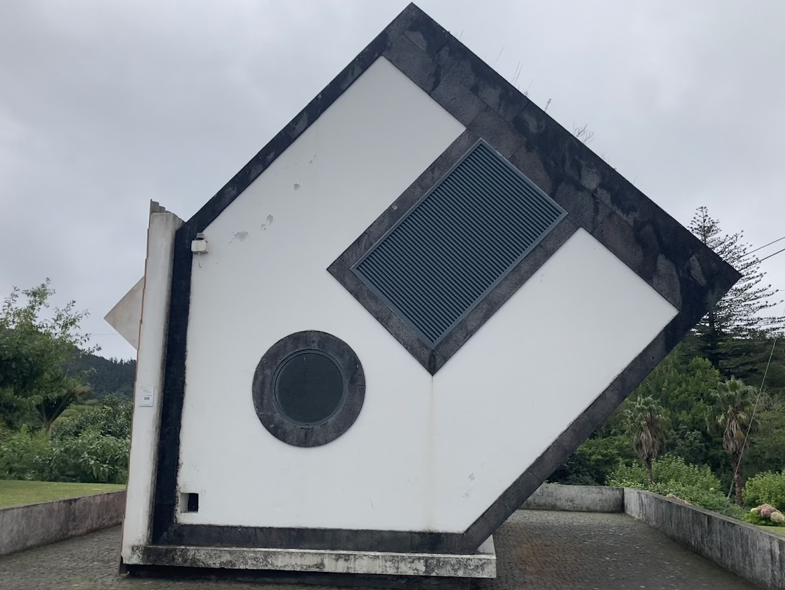

Další atrakcí, která jde ve Furnas navštívit je [zahrada s termálními bazénem](https://www.parqueterranostra.com/en/). My jsme ji ale vynechali, protože už jsme neměli moc času, ale vypadala fakt nádherně.

Termály, které jsme se ale rozhodli vyzkoušet byly [Poça da Dona Beija](https://pocadadonabeija.com/). S parkováním byl trochu problém, takže jsme parkovali trochu dál. Vstupné bylo 12 euro na hodinu. Termály se skládaly z pěti bazénků s různou výškou vody a byly v nádherném prostředí pralesa a lidí bylo tak jako průměrně. Celkově to byl fakt fajn zážitek a krásně jsme si odpočinuli. Jediné, co nás trošku zklamalo bylo, že všechny bazénky měly stejnou teplotu.


  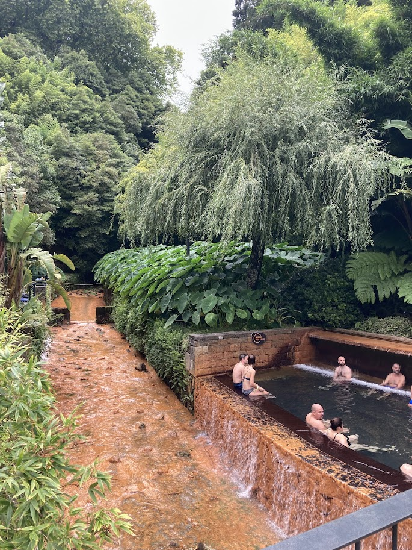
  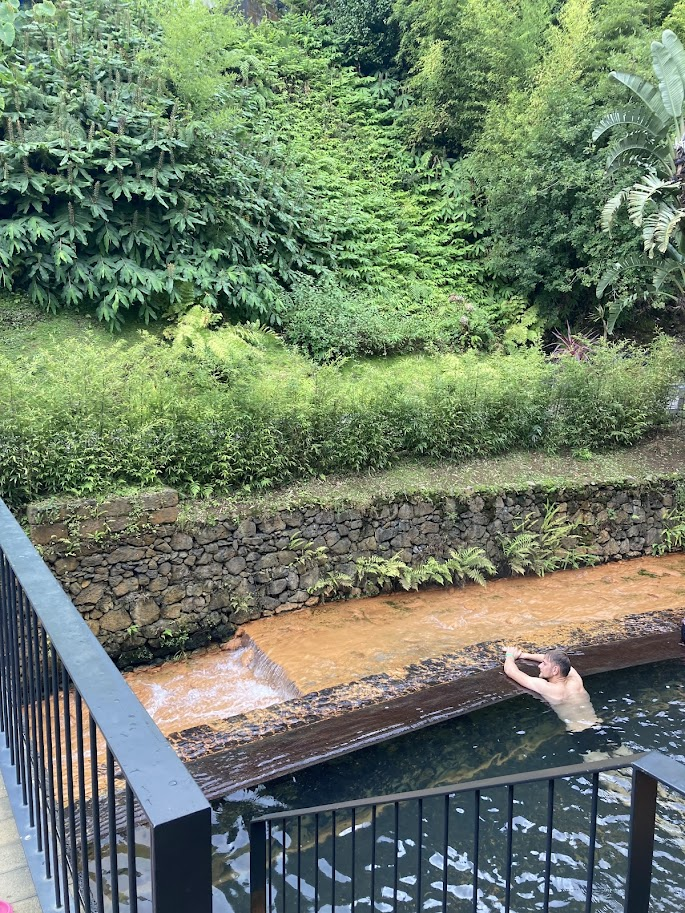


Jako poslední věc tento den jsme se zajeli podívat na vodopád [Ribeira Quente](https://mapy.com/s/nuvebetohe), který dost překvapil a byl to největší vodopád, co jsme na ostrově viděli. Z Furnas to byla sice zajížďka, ale stálo to za to.

Vodopád je poměrně schovaný. Je potřeba zaparkovat ještě před tunelem, pak projít pěšky tunelem a k vodopádu dojít skrz řeku, do které vodopád teče. Suchou nohou to ale jde jen tak napůl. 

" )

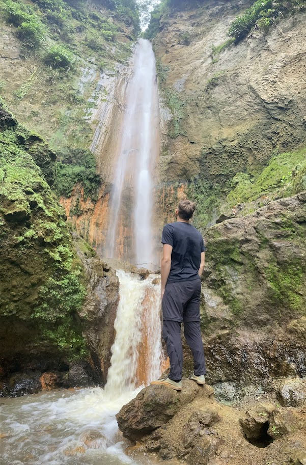

## Šestý den: Západní část ostrova

Poslední den jsme měli let až ve večerních hodinách, tak jsme ráno ještě vyrazili na západ ostrova, abysme to měli blízko na letiště.

Nejprve jsme navštívili zajímavé termály [Ponta da Ferraria](https://pontadaferraria.com/), které se nachází v poměrně čerstvém lávovém poli v okolí skalních bran a útvarů. Do koupaliště v oceánu totiž vyvěrá geotermální pramen, takže se zde dá koupat v krásně teplé vodě a zároveň si užívat vlny. 


  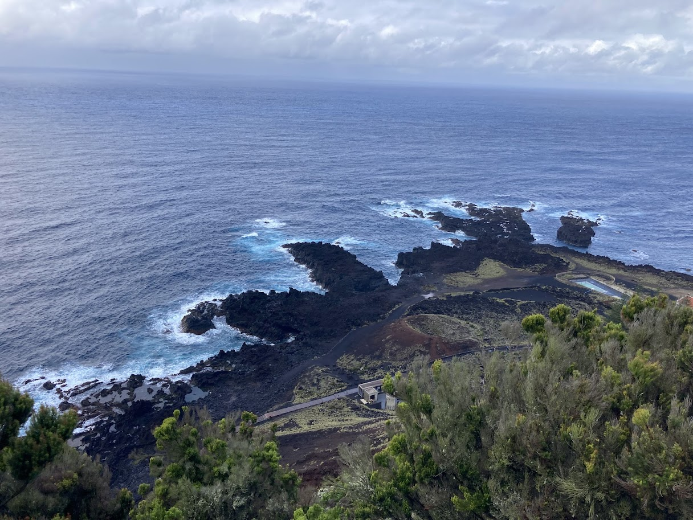
  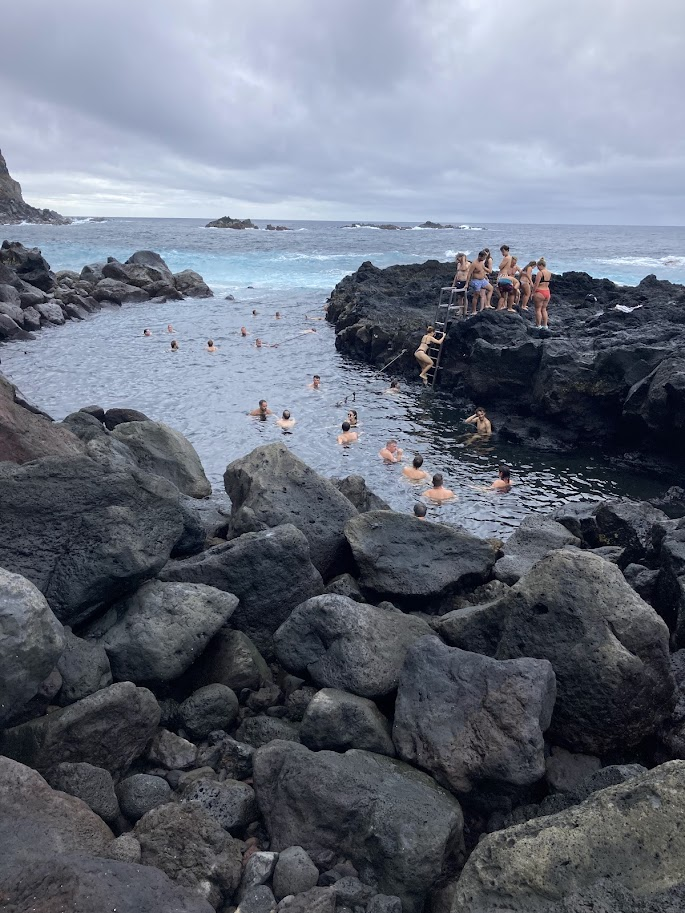
  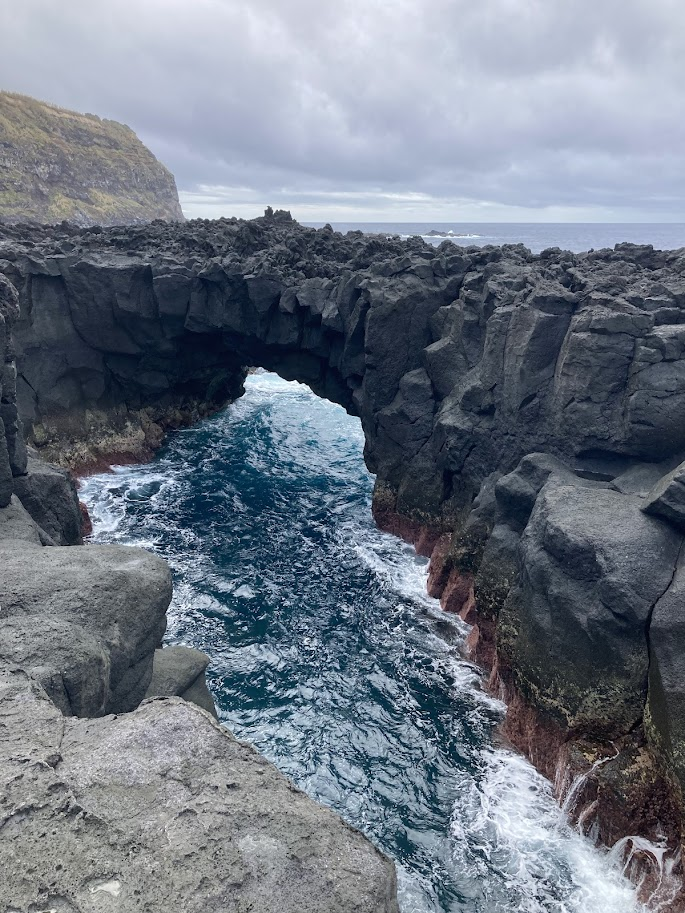
  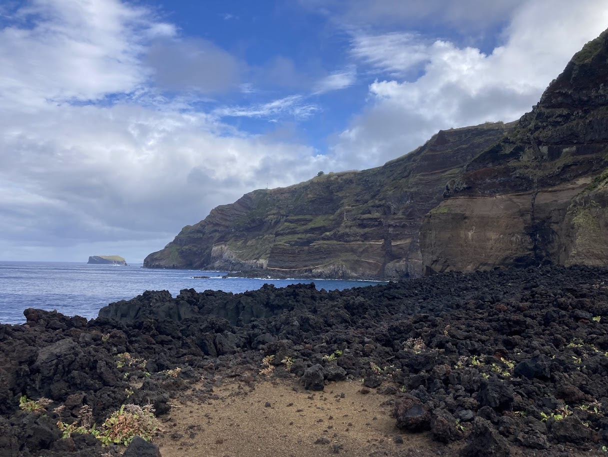


My jsme ale neměli plavky, takže jsme si akorát prošli lávové pole a koukali na spoustu krabíků.

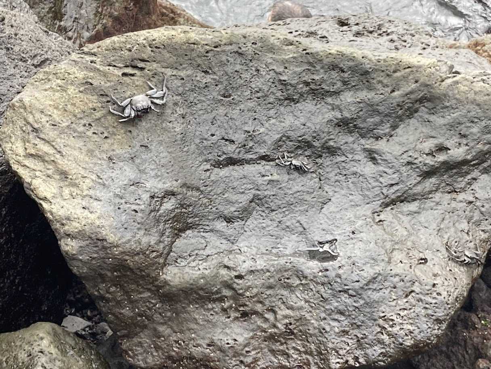

Parkovat se teda dalo jen na [horním parkovišti](https://mapy.com/s/nodefalafu), takže cesta zpět byla krapet do kopce. Dali jsme si tam ale aspoň dobrý [kafe](https://maps.app.goo.gl/XedBNriVpfwXD26y9).



Pak jsme pokračovali do městečka [Mosteiros](https://mapy.com/s/karodejelo), kde jsme si udělali krátkou procházku po pobřeží kolem útesů a přírodních koupališť. 

{{< carousel images="{img/6_plaz.jpg,img/6_mosteiros.jpg}" >}}

V městečku jsme pak zašli na oběd do rybí restaurace [O Chico](https://maps.app.goo.gl/jm4mnzhcXEouP7rq6), která nás dost překvapila milou rodinnou atmosférou a výborným jídlem. 

Tímhle zážitkem pro nás výlet na Azorách skončil a dál už jsme jen dojeli na letiště a odletěli zpět do Porta.

## Shrnutí

Celkově Azory hodnotíme jako jednu z nejhezčích dovolených. Příroda je zde fakt nádherná a ať zajedete kamkoli, neuděláte chybu. Stačí jen jet autem po dálnici a je se čím kochat. Důležitým aspektem ale taky bylo, že jsme měli štěstí na počasí, protože nám téměř nepršelo, i když jsou Azory jinak dost deštivé.

Taky asi hrálo roli, že jsme je navštívili na začátku října, což už bylo mimo sezónu, takže jsme se s největšími davy setkali jen na výhledu [Vista do Rei](https://mapy.com/s/natepumuca) nebo ve Furnas u [geotermálních pramenů](https://mapy.com/s/dulopegeco). 

K mému milému překvapení na začátku října dokonce ještě kvetlo pár hortenzií a lilií, takže celý ostrov působil jako jeden velký park a nedovedu si představit, jak to vypadá, když jsou rozkvetlé všechny.

