+++
date = '2025-10-10T19:20:13+01:00'
draft = true
title = 'Sao Miguel'
tags = ['týdenní výlet']
+++

Sao Miguel je největší a nejlépe přístupný ostrov Azorských ostrovů.

Z Porta na Sao Miguel (Ponta Delgada) 3 dny v týdnu létá společnost Ryanair.
Na 6 dní jsme se zvládli sbalit do příručního zavazadla, takže jsme ušetřili za odbavené zavazadlo.
Zpáteční letenky nás vyšly na 82.5 EUR na osobu.

## Ubytování

Ubytování jsme našli přes Booking ve městě Vila Franca do Campo, které je asi 20 minut jízdy po dálnici od letiště.

## Auto

Rozhodně bych doporučil půjčit si na letišti auto, ostrov je dost členitý a silnice jsou v dobrém stavu.
My jsme si půjčovali u [Go Rent a Car](https://www.gorentacar.pt/en/).
Fiat Panda nás vyšel na 158.5 EUR na 6 dní (včetně 72 EUR plné pojistky bez spoluúčasti a druhým řidičem zdarma).

## První den: Jezírka východně od Sete Citades

Náš let trval z Porta něco málo přes dvě hodiny a na letiště do Ponta Delgada jsme dorazili dopoledne, takže jsme si zašli pro auto a rovnou jsme vyrazili na první výlet.

Jelikož byl poměrně hezký den, mířili jsme na západ na trek kolem jezírek v oblasti Sete Citades.

Cestou jsme se ještě stavili na kávu a oběd. Oba podniky, co jsme navštívili, vypadaly zvenku trochu pochybně - měly místo dveří korálky a před nimi posedávali místní důchodci a hráli domino. U obou nás ale jídlo nakonec mile překvapilo. Například portugalská [bifana](https://en.wikipedia.org/wiki/Bifana), kterou jsme ochutnali ve snackbaru [Rei das Bifanas](https://maps.app.goo.gl/xT5doPGQUXpc6mTF7) ve vesničce Feteiras, byla opravdu luxusní.

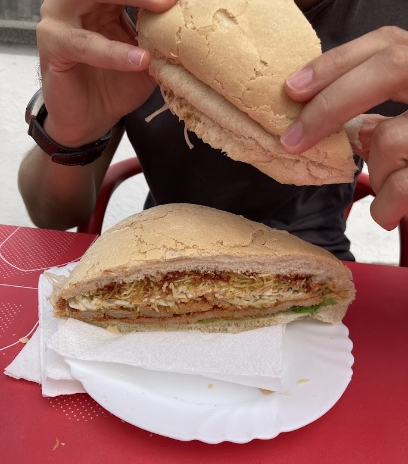

Naše další zastávka po cestě byla asi na nejprofláklejším výhledu [Vista do Rei](https://mapy.com/s/natepumuca), kde jsme téměř nemohli zaparkovat.

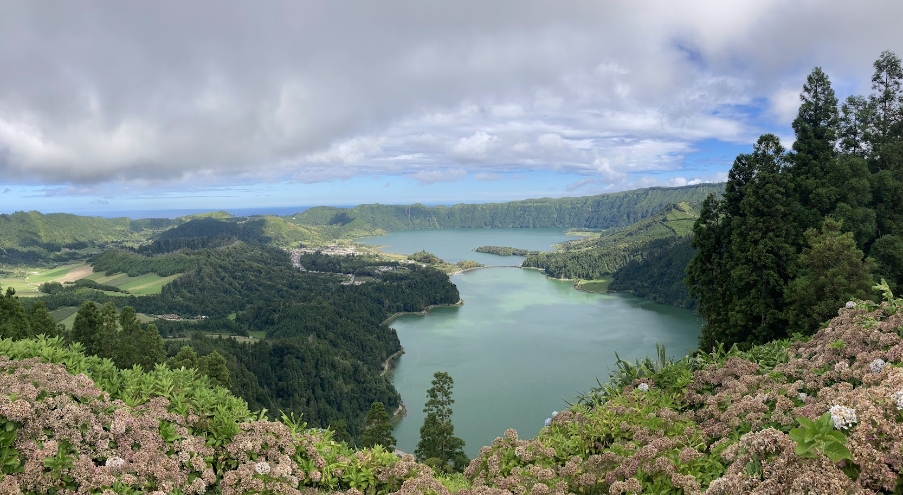

Pak už jsme jen kousek popojeli a zaparkovali na parkovišti u [akvaduktu do Carvão](https://mapy.com/s/fujebujete) a vyrazili na 6 kilometrový trek. 



Už na parkovišti byla dost mlha a jakmile jsme vyrazili nahoru bylo to ještě horší, takže jsme na začátku z výhledů neviděli skoro nic. I tak byla okolo ale uplně krásná zeleň takže jsme si procházku užili i v mlze.

{{< carousel images="{img/1_akvadukt.jpg,img/1_mlha.jpg,img/1_hortenzie.jpg,img/1_cesta.jpg,img/1_zelen.jpg}" >}}

Nejprve jsme míjeli [jezero Rasa](https://mapy.com/s/revebalage), které bylo v nížině a potom jsme stoupali nahoru k jezírkům [Lagoa das Eguas sul](https://mapy.com/s/letodeboge) a [Lagoa das Eguas norte](https://mapy.com/s/gocagojaco), které nás naprosto uchvátily. 

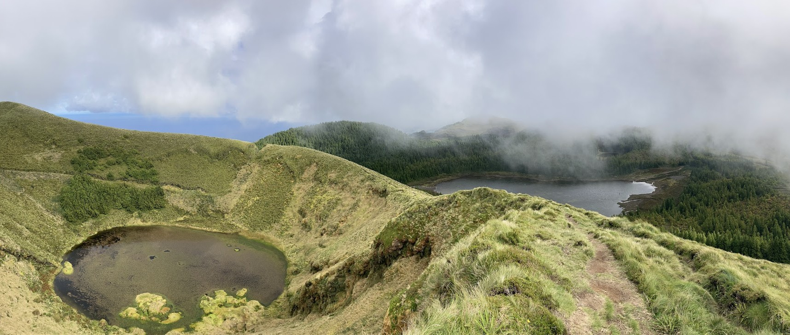

Na začátku jsme teda nic neviděli, protože byla mlha, ale stačilo pár minut počkat a výhled byl opravdu nádherný. Čekání na to, než přejde mlha, se pak na Azorech stalo téměř pravidlem. 


  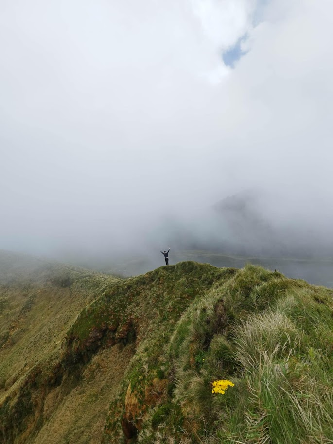
  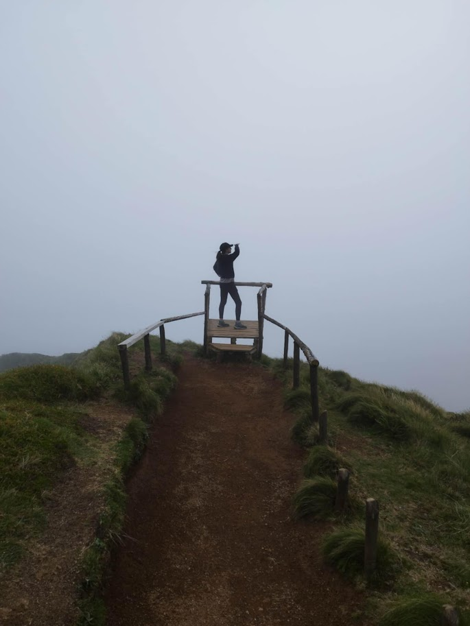


Dál jsme pokračovali po hřebeni kolem [Lagoa das Eguas norte](https://mapy.com/s/gocagojaco), odkud byl krásný výhled na sever ostrova, kde už bylo jasno.

{{< carousel images="{img/1_norte.jpg,img/1_norte_hreben.jpg,img/1_vyhledsever.jpg,img/1_haros.jpg}" >}}

Z hřebene vedla lesní cesta, která navazovala na cestu obklopenou hortenziemi. Většina hortenzií už byla sice odkvetlá, ale i na začátku října se našlo pár, které ještě kvetly.


  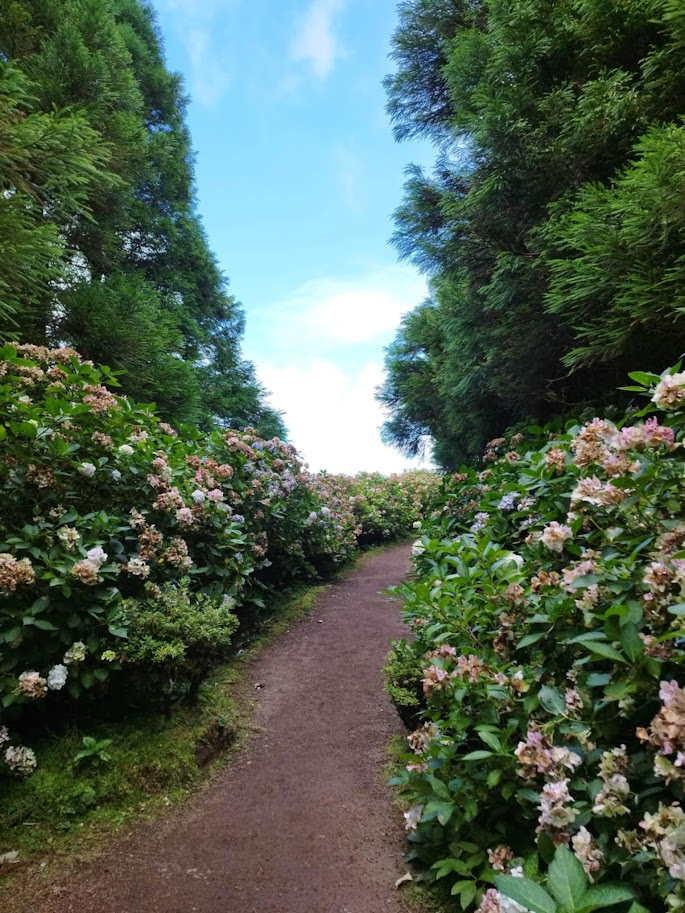
  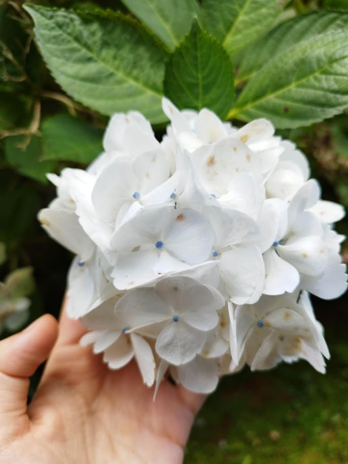


Cesta obklopená hortenziemi byla ale mimo naši naplánovanou trasu a končila slepě,  takže jsme k autu museli sejít z kopce po louce a po silnici. 

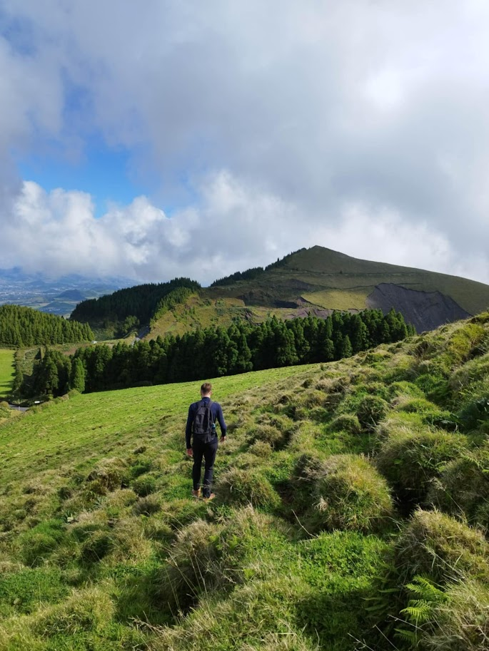

Po cestě na ubytování jsme se ještě zastavili na krátkou zastávku na útesech na severu, kde je [Tromba do elefante](https://mapy.com/s/jalugudalo), což je známý útes ve tvaru slona. 

{{< carousel images="{img/1_slon.jpg,img/1_utesy.jpg,}" >}}

Cesta na ubytování byla ale ještě dobrodružná. Jeli jsme po severním břehu, až jsme dorazili do městečka [Rabo de Peixe](https://mapy.com/s/nukonefuba). Uprostřed města byla ale najednou hlavní silnice uzavřená zákazem vjezdu. Rozhodli jsme se to teda objet po vedlejší, kde žádný zákaz nebyl, ale vjeli jsme přímo do centra jakýchsi oslav a pěší zóny, takže jsme to museli dost zdlouhavě vycouvávat a objíždět celé město.

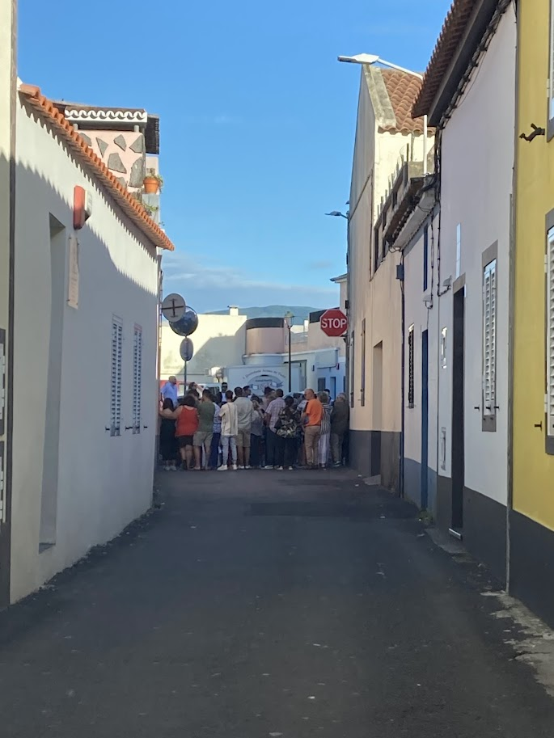

Později jsme dohledali, že tam zrovna probíhali slavnosti [Festa de Nossa Senhora do Rosário](https://www.facebook.com/groups/acores.global/permalink/24759099977114183/), tedy slavnosti Panny Marie Růžencové, což je patronka tohoto rybářského městečka. To, na co jsme narazili byl pravděpodobně Cortejo Recolha das Ofertas, v doslovném překladu Průvod pro sbírku obětních darů, kdy místní prochází vyzdobeným městem a nesou sošku Panny Marie.

## Druhý den: Střední část ostrova

Prvním cílem našeho druhého dne bylo [Lagoa do Fogo](https://mapy.com/s/kabavazepa), které se nachází v pohoří ve středu ostrova. Vyráželi jsme z ubytování za krásného slunce, ale jakmile jsme vyjeli jenom do trochu vyšší nadmořské výšky, byla okamžitě hustá mlha a bylo nám jasné, že nic moc z jezera neuvidíme. 

Zaparkovali jsme na [parkovišti](https://mapy.com/s/lapehubapa) u výhledu na jezero, ale přes mlhu jsme si ani nebyli jistí, jestli tam jezero vůbec je. K jezeru jsme z výhledu sesoupili krátkou, ale dost prudkou [cestičkou](https://mapy.com/s/gedozopefo). 


  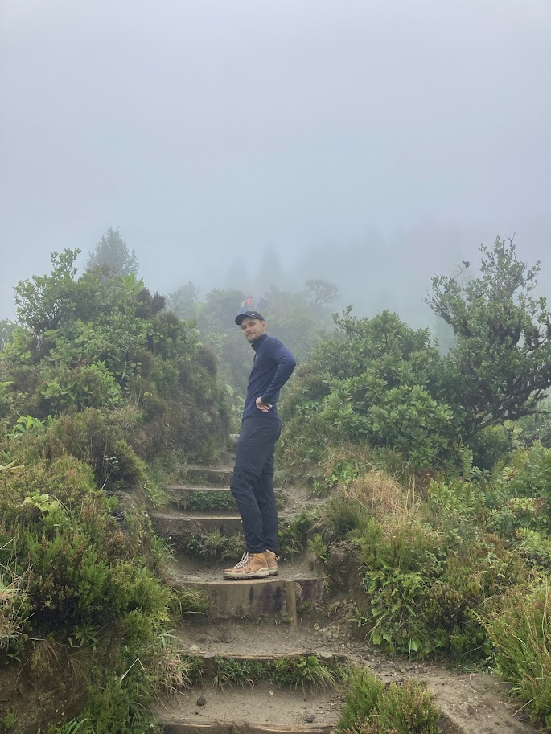
  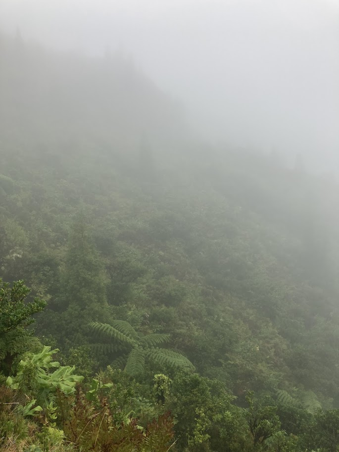


Jezero jsme spatřili téměř až jsme sestoupali úplně dolů k němu. Pokračovali jsme ještě kousek podél pláže, ale výhledy stále nebyly nic moc.

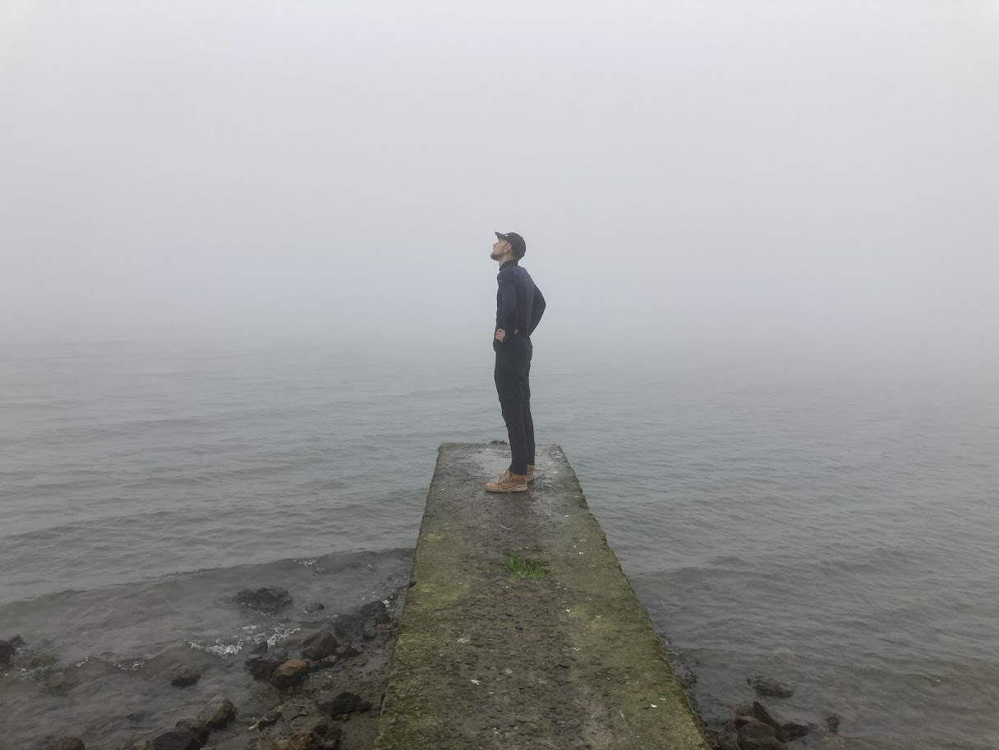

Delší procházku kolem jezera jsme teda vzdali a vystoupali zpátky k autu. Nahoře nakonec mlha trochu ustoupila a jezero se nám na chvíli ukázalo.

Dál jsme se vydali směrem k vodopádům a termálům [Caldeira Velha](https://mapy.com/s/delezotodo), kde byl původní plán se vykoupat, ale Martin si zapomněl plavky a taky měli volná místa až za hodinu, takže jsme se tam nakonec nepodívali. 

Caldeira Velha jsou jinak termály, které obklopuje krásná příroda a vodopády. Cenově vycházely s koupáním na [10 euro](https://parquesnaturais.azores.gov.pt/en/parques/9/centro/21/horarios). 

Další místo, které jsme navštívili bylo v okolí vesničky [Porto Formosa](https://mapy.com/s/fapobusavu). Šli jsme tam krátký okruh okolo vodopádu a útesů.



Naše trasa začínala u vodopádu [Cascata do Porto Formosso](https://mapy.com/s/komuduvebu), který nás hodně překvapil. Původně jsme totiž na toto místo jeli hlavně kvůli útesům kolem moře a vodopád nebyl náš hlavní cíl. 

Vodopád ale působil fakt hezky, protože v něm byl dostatek vody a v jeho okolí byla krásná "džungle" a spousta hortenzií. 

{{< carousel images="{img/2_portoformosso_vodopad.jpg,img/2_okoli_vodopadu.jpg,img/2_hortenzie.jpg}" >}}

Pod vodopádem bylo i malé jezírko, kde se dalo vykoupat, což nás nalákalo, ale řekli jsme si, že se osvěžíme, až projdem celou trasu. 

Trasa vedla dál k pobřeží a útesům. Prošli jsme džunglí, bambusovou stezkou, pak po pastvinách kolem krav a býků v dost těsné blízkosti a dorazili jsme k [rozhledně](https://mapy.com/s/mamarufeje), odkud bylo vidět na skalní bránu v moři. 


  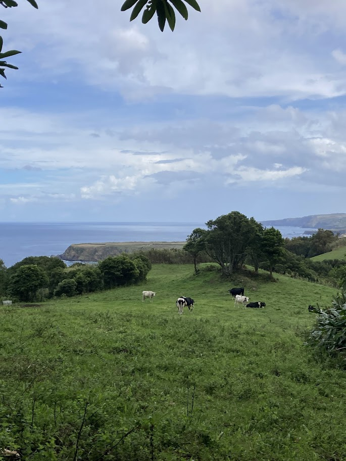
  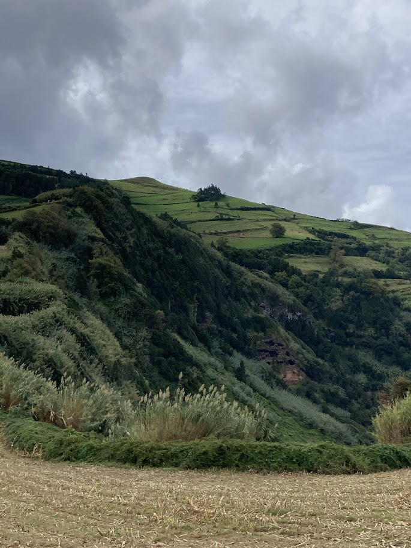


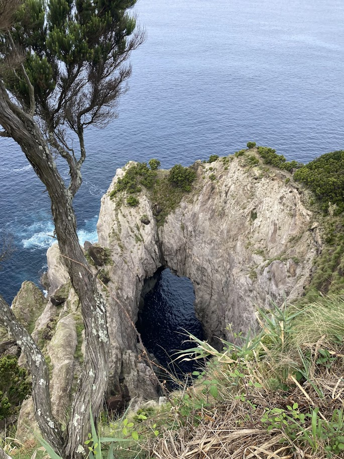

Pak už jsme pokračovali podél moře směrem zpátky k vesničce. Cestou jsme míjeli další krásné útesy a pláž.

{{< carousel images="{img/2_utesy.jpg,img/2_plaz.jpg,}" >}}

Když jsme se vrátili k autu, akorát jsme se převlékli do plavek a dali jsme skvělou koupel pod vodopádem.

Naše trasa směřovala dál k výrobně čaje [Chá Gorreana](https://mapy.com/s/jozofegeme), okolo které se rozkládají čajové plantáže. Čajové plantáže [Chá Gorreana](https://gorreana.pt/en/) jsou nejstaršími dosud fungujícími čajovými plantážemi v Evropě, které jsou v provozu od roku 1883 a výrobna čaje zůstává vlastněná rodinou původních majitelů. Plantáže jsou tvořeny malými stromky čajovníku čínského (Camellia sinensis), jehož lísky se sklízejí v období mezi dubnem a říjnem a potom se z něj vyrábí 3 typy čajů - zelený, černý a oolong. 

Zaparkovali jsme přímo u výrobny čaje, kde nebylo moc místa, ale měli jsme štěstí, že jsme nějaké našli. Pak jsme okolo šli krátký track okolo čajových plantáží a vedlejšího vodopádu [Salto da Cidreira](https://mapy.com/s/fuvasakopa).



Plantáže byly krásně upravené a rozlehlé. Na hlavní cestě bylo docela dost lídí, ale když jsme trochu poodešli od parkoviště, už tam nebyl skoro nikdo. 

{{< carousel images="{img/2_plantaz2.jpg,img/2_plantaz3.jpg,img/2_lilie.jpg,img/2_plantaz4.jpg,img/2_plantaz5.jpg}" >}}

Po okruhu kolem plantáže jsme se vydali ještě na vodopád [Salto da Cidreira](https://mapy.com/s/fuvasakopa), protože byl relativně kousek a přišla nám škoda se k němu nepodívat. Cesta k němu vedla podél akvaduktu a říčky, která zásobovala vodní nádrž vedle výrobny čaje.

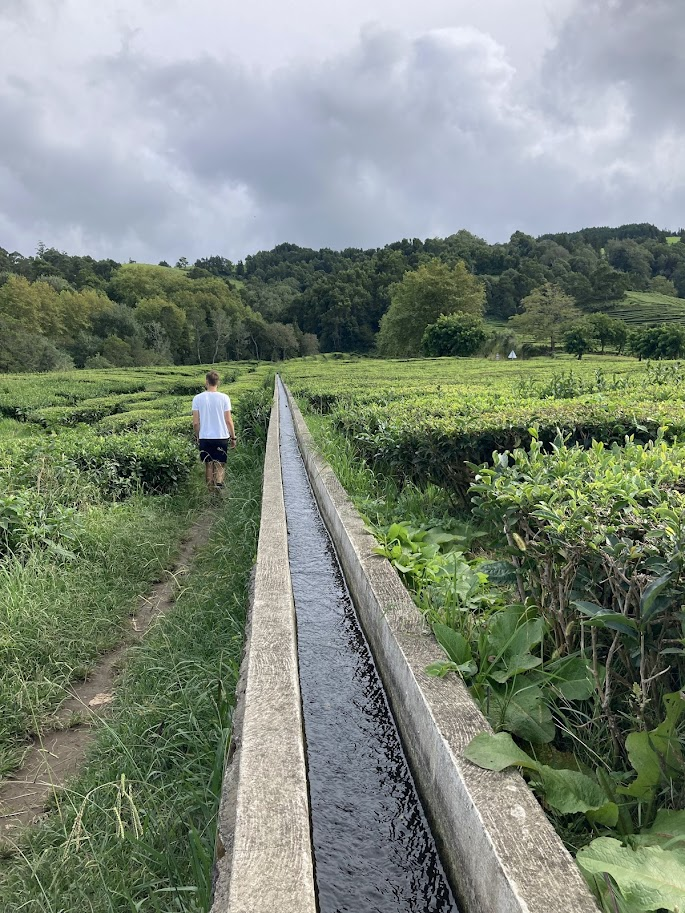

Cesta k vodopádu byla sice moc hezká, ale vodopád už tolik ne. 


  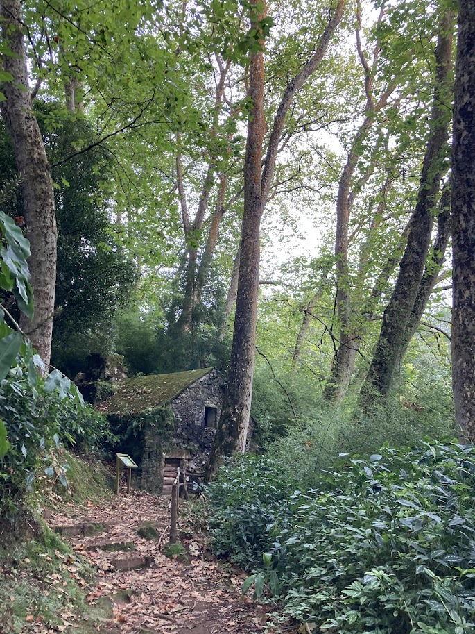
  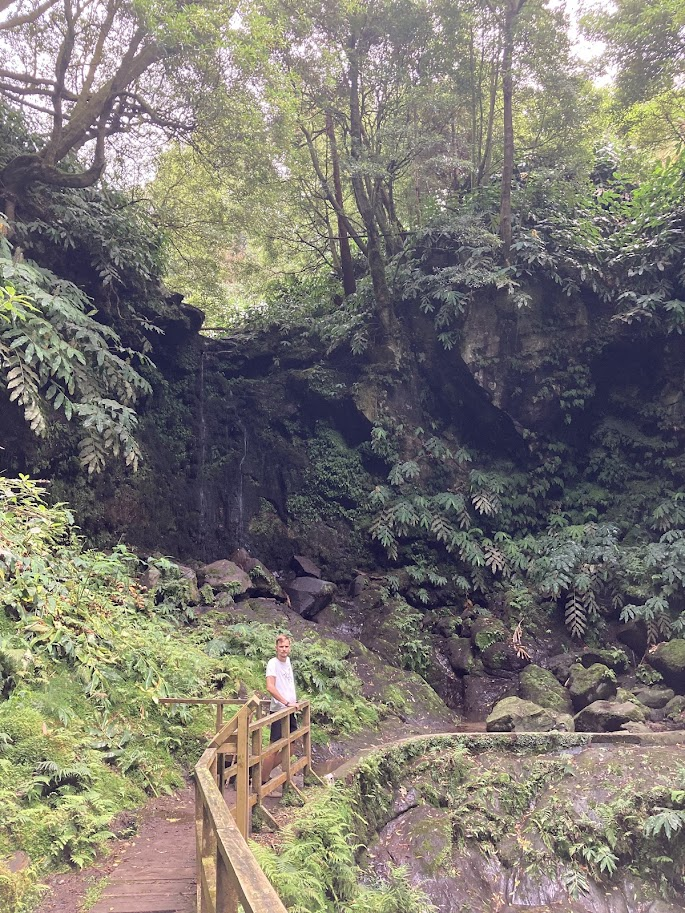


Když jsme se vrátili na parkoviště, měli jsme v plánu jít ještě na prohlídku výrobny čaje, ale byli jsme dost unavení, tak jsme nakonec navštívili jen suvenýry a koupili si azorský čaj.

Při zpáteční cestě na ubytování jsme se ještě rozhodli si udělat zastávku u jezera [Lagoa do Congro](https://mapy.com/s/kabegofodu), kolem kterého jsme jeli. Cesta na [parkoviště](https://mapy.com/s/mukodahelo) z hlavní silnice byla po dost blátivé a rozježděné cestě. K jezeru se pak dalo sejít po ještě blátivější [cestičce](https://mapy.com/s/jovupedohu).


  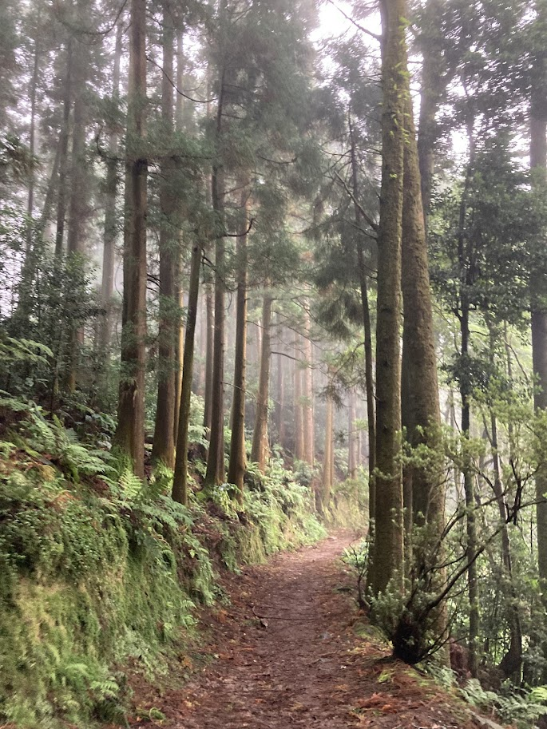
  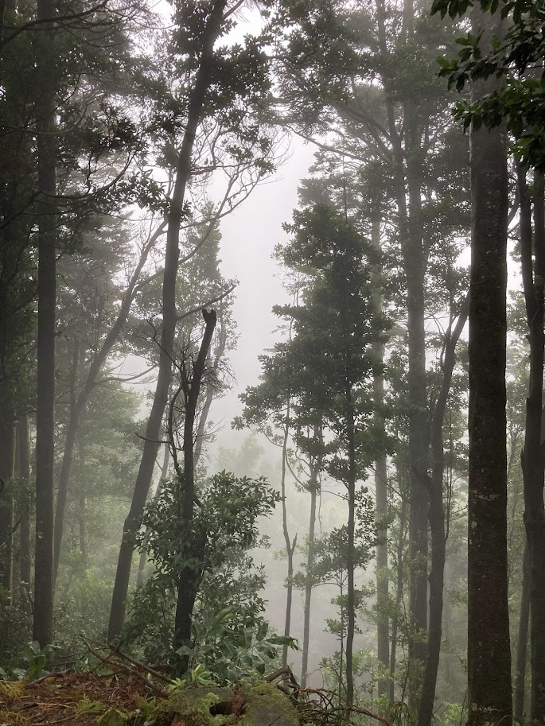


Kolem jezera Congro byly krásné vysoké stromy, které voněly jako vavřín. Mlha dodávala okolí jezera zajímavou atmosféru. 

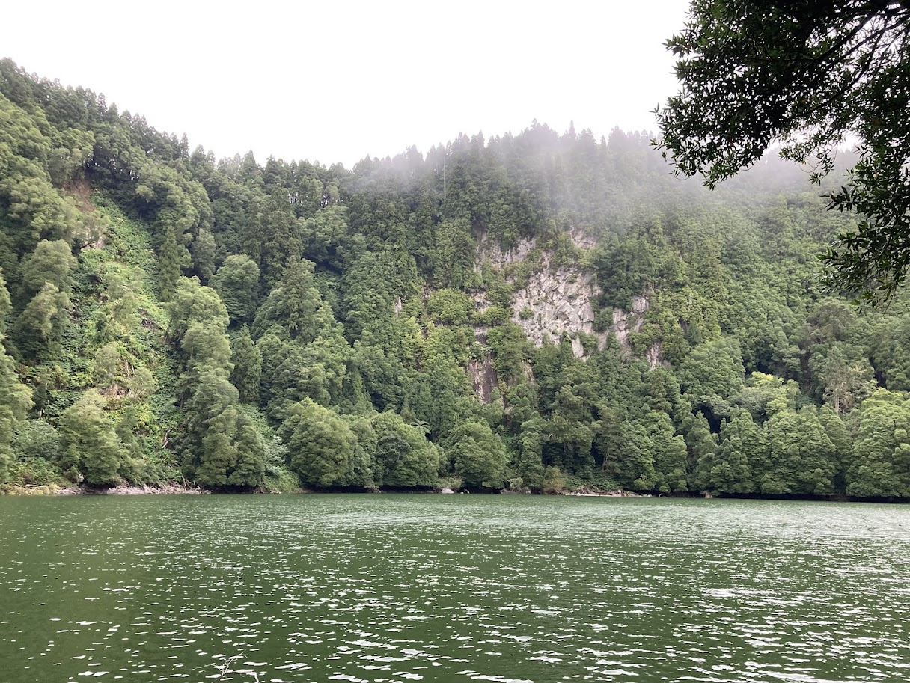

## Třetí den: Severovýchod

Ráno jsme se vydali na procházku ke kapličce [Ermida de Nossa Senhora da Paz](https://mapy.com/s/leperopago). Šli jsme pěšky z našeho ubytování, což bylo poměrně kousek, ale taky dost do kopce. Po cestě jsme míjeli několik polí s banánovníky a krásné výhledy na moře a ostrov [Ilhéu de Vila Franca](https://mapy.com/s/rebumujece).


  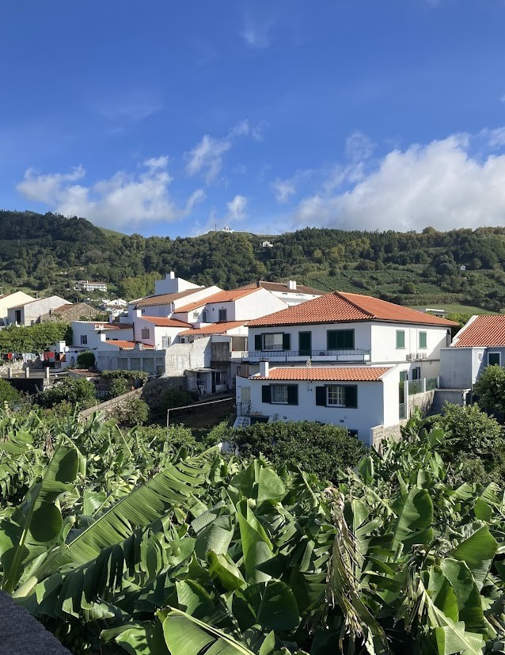
  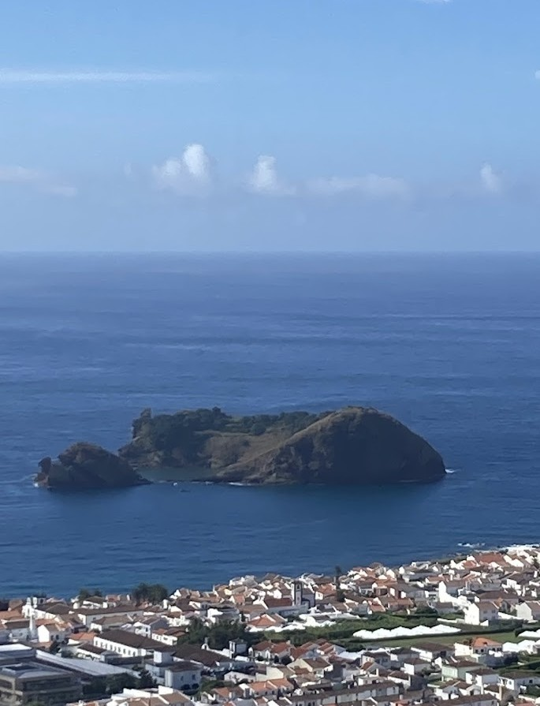


")

")

Odpoledne jsme se vydali na severovýchod ostrova na trek ke dvěma vodopádům - [Salto da Farinha](https://mapy.com/s/bamadubudu) a [Cascata do Risco](https://mapy.com/s/bajupevaba).



Parkovali jsme kousek od vodopádu [Salto da Farinha](https://mapy.com/s/bamadubudu), kam se sice dalo dojet autem, ale k parkovišti vedla dost strmá silnice, takže příště bysme asi auto nechali už na dřívějším parkovišti.

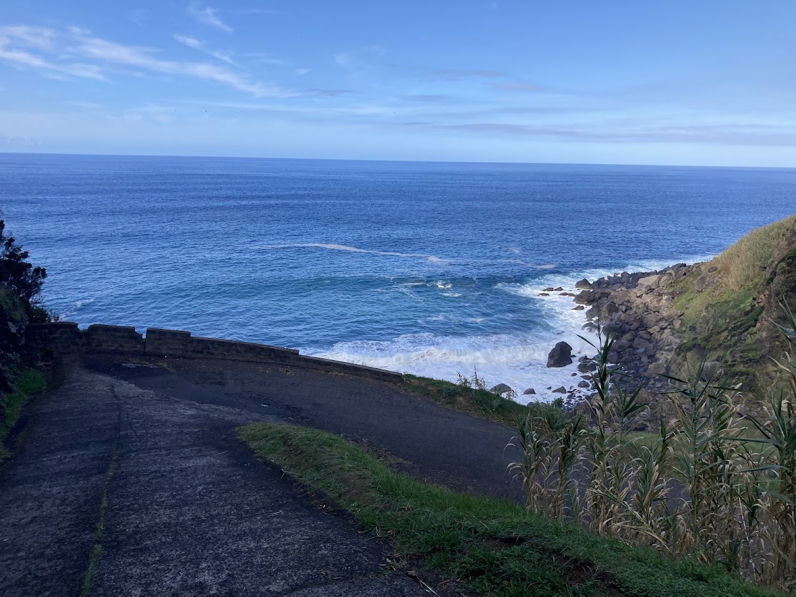

")

Původně jsme teda chtěli jsme dojít až k vodpádu [Cascata do Risco](https://mapy.com/s/bajupevaba), ale první vodopád byl celkem vyschlý, takže jsme došli jenom k [Poço Azul](https://mapy.com/s/baselarazo) a cestu ke druhému vodopádu jsme nakonec vzdali.

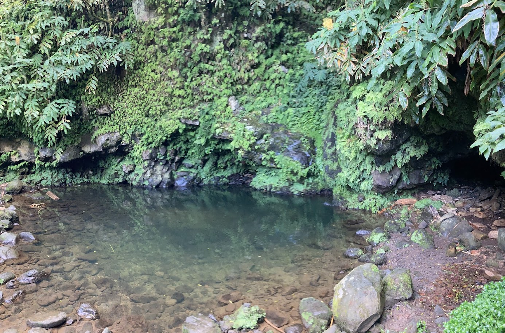

Trasa byla jinak docela pěknou přírodou, až na to, že část vedla po silnici a celkově měla trasa docela velké převýšení, takže se výlet tolik nepovedl. Co musím ale ocenit, tak jsou lilie [Amaryllis belladonna](), které silnici lemovaly.

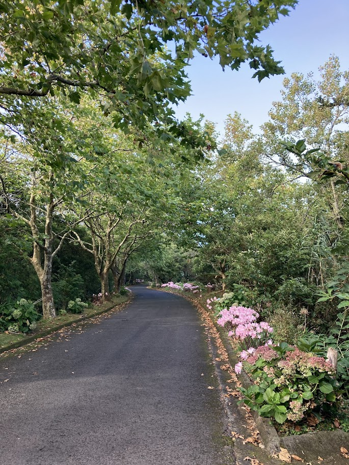

Pak jsme popojeli kousek dál východně k [Parque Natural dos Caldeiroes](https://mapy.com/s/nabuzujaka), kde jsme si udělali krátkou kolem umělé kaskády vodopádů, které tečou nehledě na roční období. V parku se nachází také pět původních mlýnů z 16. století. Kvůli snadné dostupnosti místa a působivým vodopádům tam bylo docela dost lidí, ale návštěva myslím stála za to. 


  
  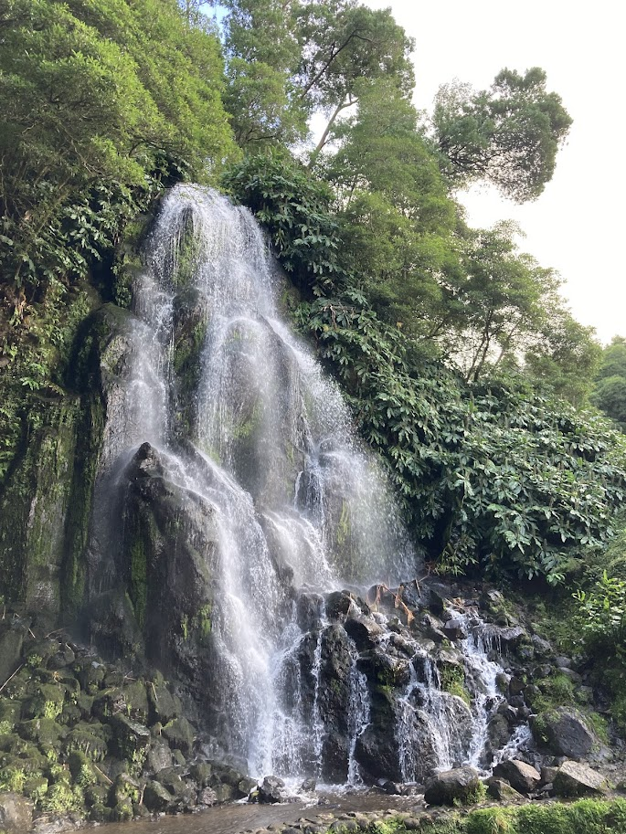
  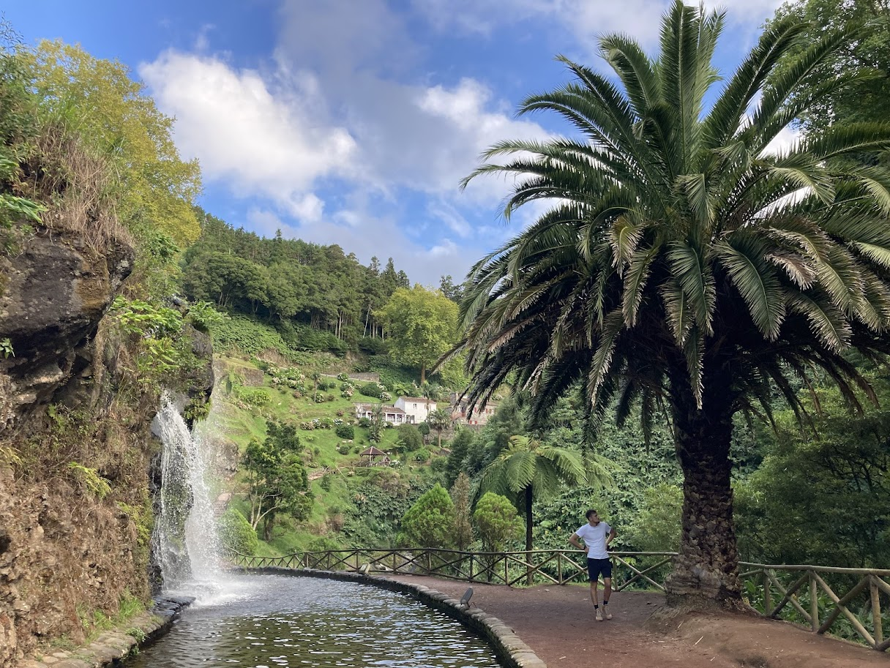


Na večer jsme dojeli na úplný východ ostrova k majáku [Farol do Arnel](https://mapy.com/s/fudokakebo). Prvně jsme sestoupali až k němu, ale hezčí vyhlídka [Miradouro da Vista dos Barcos](https://mapy.com/s/huvuvumecu) byla až o kousek dál, kam jsme popojeli autem.


  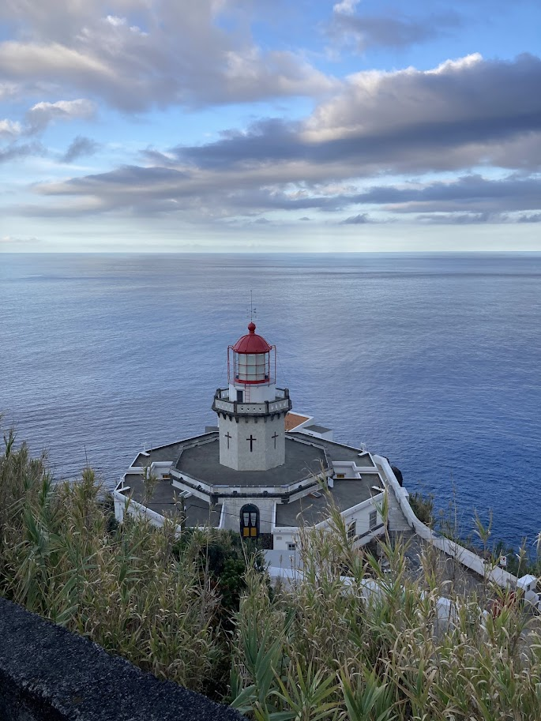
  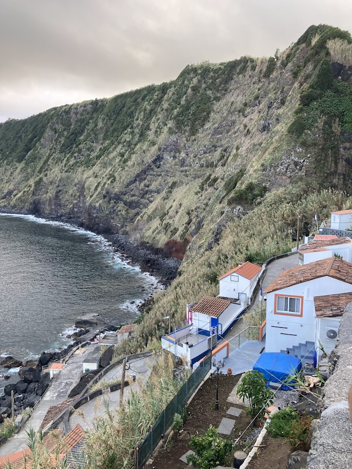


" )

##  Čtvrtý den: Sete Citades

