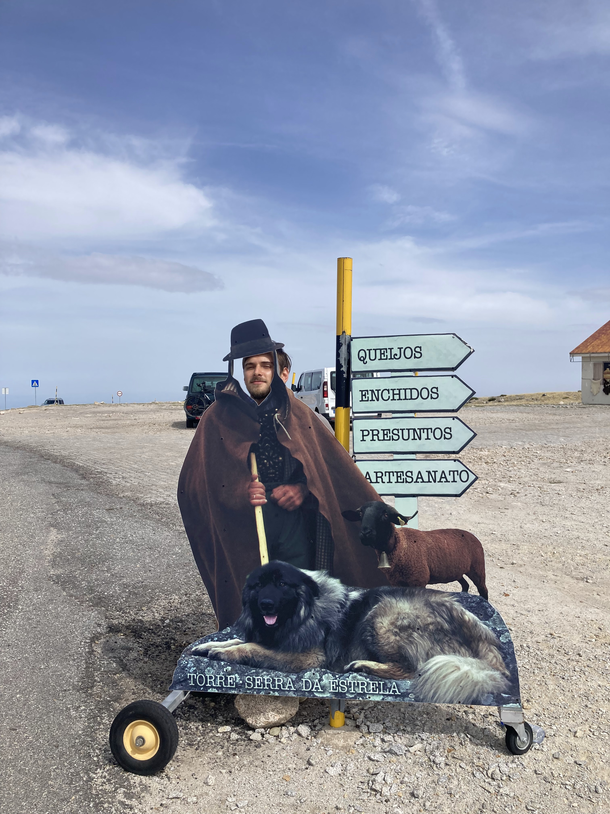
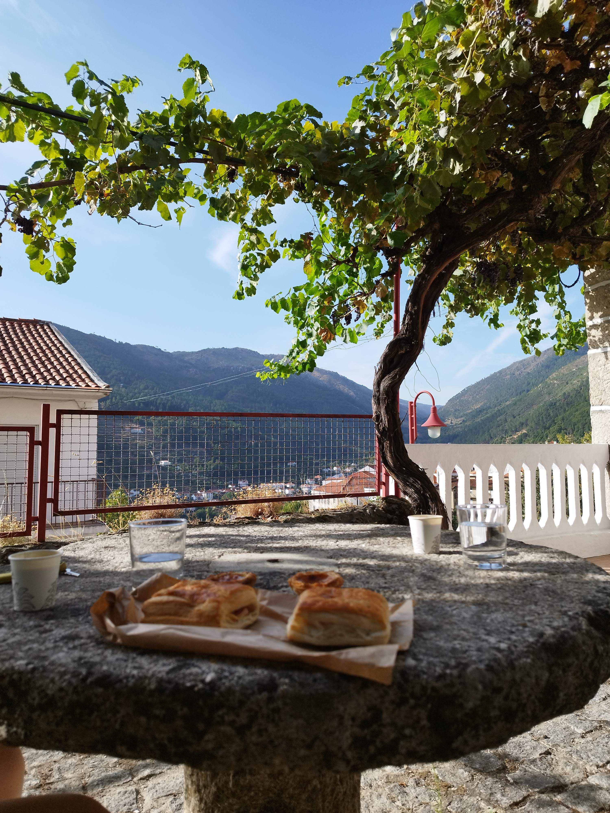
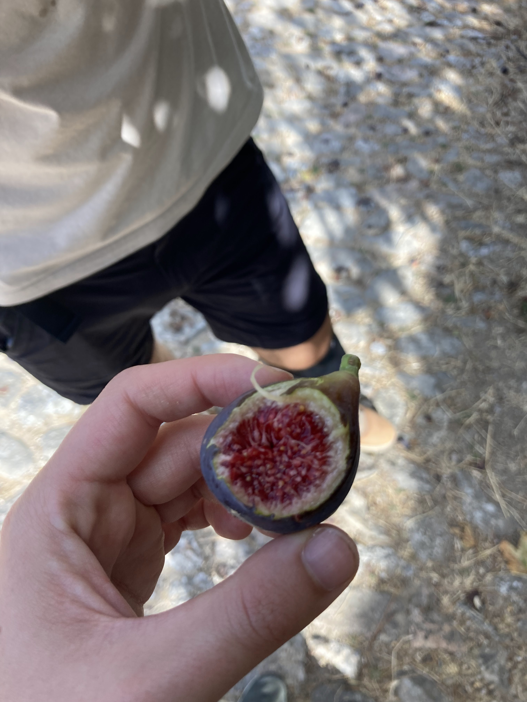
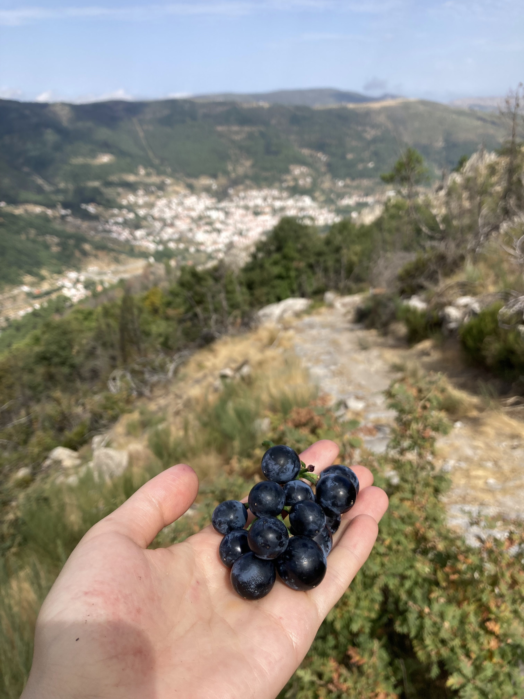
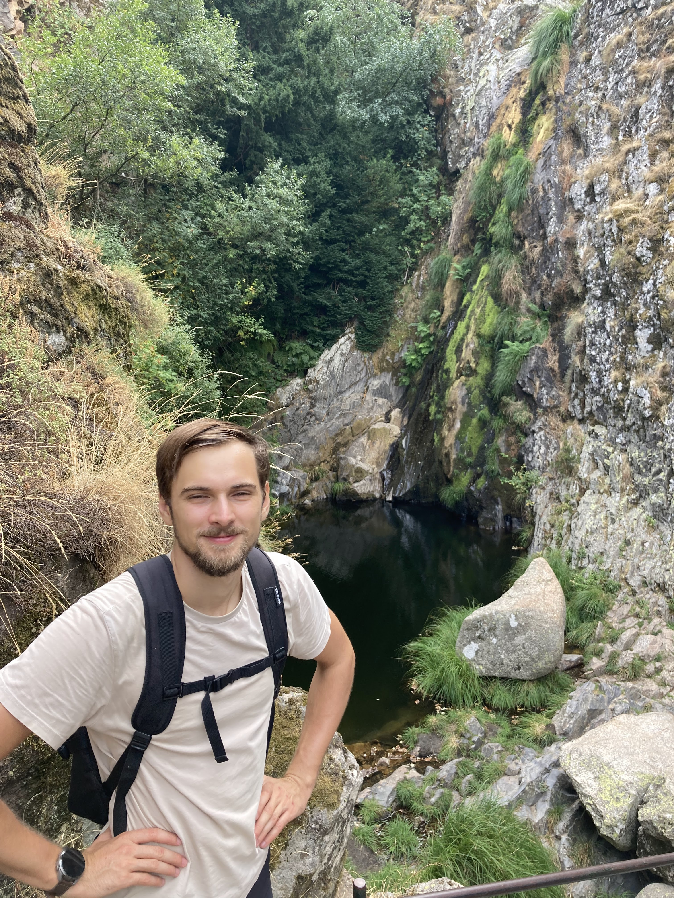
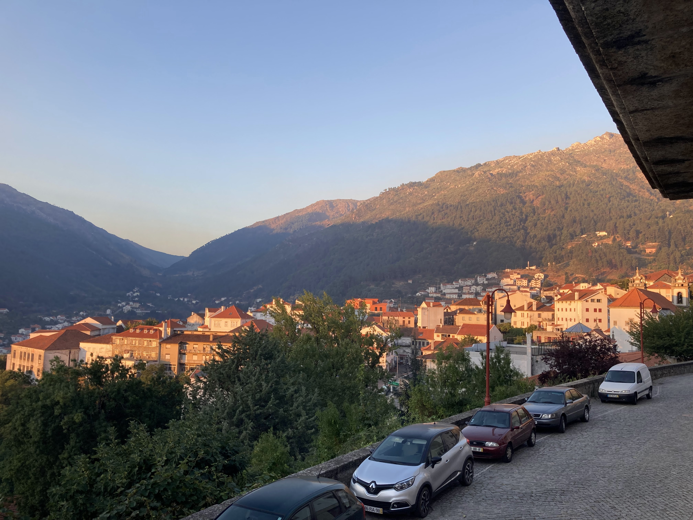
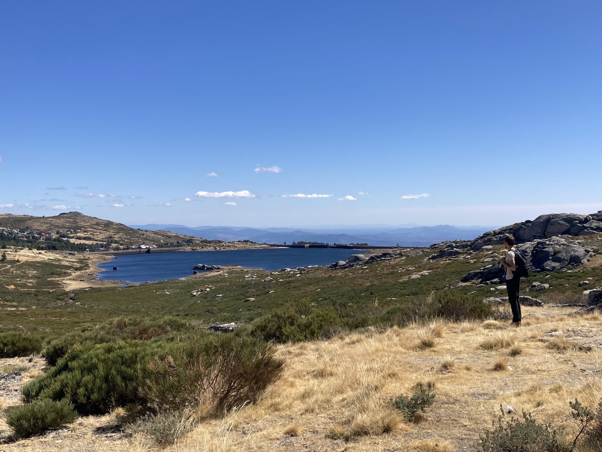
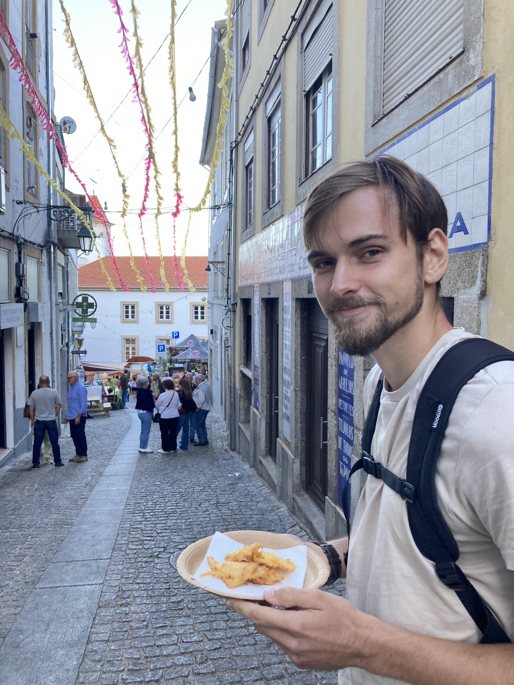

+++
date = '2025-09-22T19:28:11+01:00'
draft = false
title = 'Serra Da Estrela'
tags = ["víkendový výlet"]
+++

Jako první výlet mimo Porto jsme si vybrali pohoří [Serra Da Estrela](https://en.wikipedia.org/wiki/Serra_da_Estrela).
To je nejvyšší pohoří pevninského Portugalska s vrcholem Torre (1993 m n. m.) a zároveň tzv. "přírodní park" (Parque Natural da Serra da Estrela).

Z Porta jezdí přímý autobus společnosti Rede Expresso (zdejší konkurence Flixbusu) do města Covilha, které je hned vedle Torre.

## První den

Trasa na první den byla prakticky sestup z Torre do Manteigas, kde jsme měli ubytování.



Přímo na Torre jezdí z Covilhy [překvapivě drahý](https://covilhamobilidade.pt/Tariff) Serra Shuttle (12.10 € za zpáteční jízdenku).
Na Torre toho moc není, jeden stánek se suvenýry, kozy, a pár lidí, co si přijeli autem na krátkou procházku.

Mnohem hezčí výhledy byly když jsme popošli dál po hřebeni směrem k údolí řeky Zêzere.
Na jednom výhledu jsme obědvali a náhodou na nás narazili nějaký další Češi.

{{< carousel images="{img/andilek.png,img/IMG_8728.png,img/IMG_8735.jpg,img/IMG_8741.jpg}" >}}

Další část cesty jsme šli po trase PR5.3MTG, která spojuje trasy PR4MTG a PR5MTG.
Obecně značení turistických tras v Portugalsku není tak dobré jako v Česku, pro všechny trasy
se používá jedna značka (žlutá a červená čára), takže člověk ani nepozná, jestli jde po správné trase.

U PR5.3MTG bylo značení ale suverénně nejhorší, místo značek se používaly na sebe naskládané kameny, celá trasa byla maličká a zarostlá vysokým křovím, takže po ní leckdy ani nešlo jít.

Po přechodu z PR5.3MTG na PR4MTG se naštěstí cesta zlepšila.

Když jsme večer přišli na ubytování, zjistili jsme super novinku, že se musí jít na recepci hotelu, kterej je další 2 km daleko.

## Druhý den

Druhý den jsme šli lehčí trek z Manteigas k vodopádu Poço do Inferno a zpátky.



Ráno jsme si dávali docela na čas, takže jsme vycházeli až kolem 10:30.

Cestou městečkem jsme si nabrali zrající fíky a dokonce nás obdarovala milá místní babička čerstvě uzrálým vínem.


  
  


Výšlap nahoru byl celkem prudký, ale těšili jsme se, že půjdeme lesem ve stínu.
Nemilé překvapení bylo, že v lesech byla hromada otravných much.

Nahoře to ale bylo zase krásný.

{{< carousel images="{img/IMG_8843.jpg,img/IMG_8860.jpg,img/IMG_8850.jpg}" >}}

...takže nás vlastně ani nemrzelo, že vodopád byl vyschlej.

## Třetí den

Poslední den nás čekala dlouhá cesta zpět do Covilhy.



Z Manteigas jsme vyráželi hned po úsvitu údolím řeky Zêzere směrem k Torre.
To zní sice chválihodně, ale tím jak údolí vede ze severu na jih, tak svítá až kolem 7:30.

Cestou údolím jsme vyplašili (asi) koroptve, ale nic zajámavějšího jsme neviděli.
Zajímavější výhledy začaly být až když jsme začali prudce stoupat.

{{< carousel images="{img/IMG_8899.jpg,img/IMG_8898.jpg}" >}}

Tím, že jsme tu byli v září, cestu zdobily rozkvetlé ocúny.

Taky jsme viděli přehradu Lago do Viriato.

Za jezerem jsme si zašli do vesničky na kafe, bylo celkem vtipný, že místní byli navlečený v zimních bundách, zatímco my jsme šli v tričku. Mimo jiné jsme si dávali i cappucino, které ale chutnalo jako ohřáté Eiskaffee, takže to bylo docela zklamání. 

Zpět do Covilhy jsme se rozhodli jít pěšky i když je cesta celou dobu po silnici, protože autobus vycházel dost draze.
Tím pádem jsme se poslední kus cesty moc netěšili, ale mile to překvapilo, protože výhledy tu byly fakt super.

{{< carousel images="{img/IMG_8941.jpg,img/IMG_8944.jpg,img/IMG_8945.jpg}" >}}

Do Covilhy jsme se dostali celkem brzo, takže jsme si ještě stihli zajít do centra na pizzu.
Náhodou se tu zrovna konaly [nějaký slavnosti petržele](https://www.facebook.com/festivaldacherovia/), takže město bylo plný stánků a lidí a dokonce se konala i přehlídka sborů lidové hudby.

Zpátky do Porta jsme jeli opět autobusem Rede Expressos.

